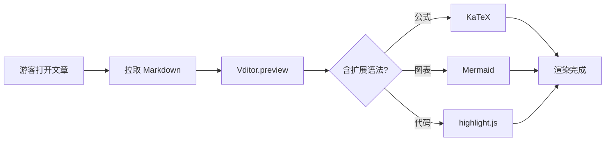
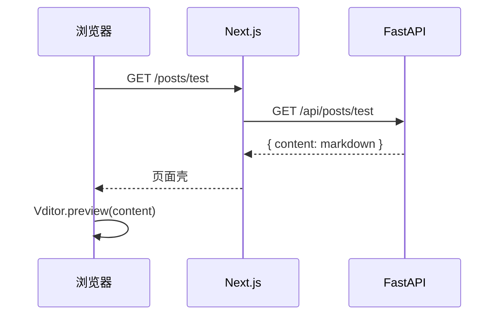
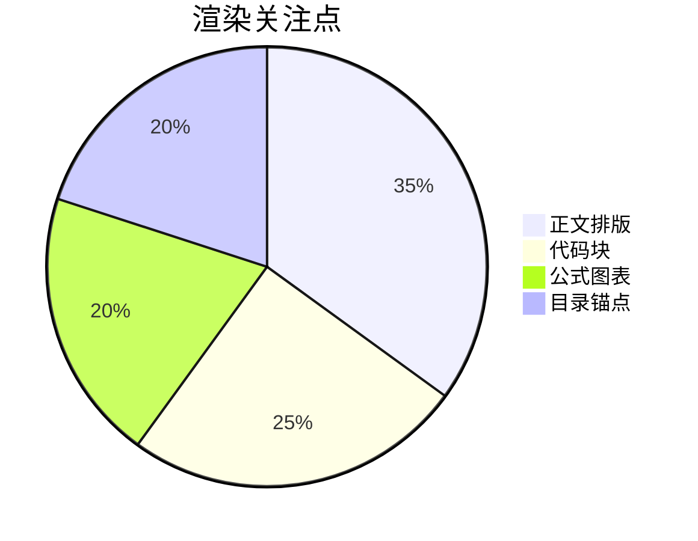

[toc]

# 文章渲染覆盖测试

> 本文用于核对前台 `Vditor.preview` 是否覆盖常用 Markdown / 扩展语法。后台编辑保存后打开 `/posts/test` 逐项对照。

正文混排：English + 中文自动空格、**加粗**、*斜体*、***加粗斜体***、~~删除线~~、==高亮 mark==、`行内代码`、上标 H~2~O、下标 x^2^。

键盘样式：按 <kbd>Ctrl</kbd> + <kbd>S</kbd> 保存。

---

## 1. 标题层级

### 1.1 三级标题
#### 1.1.1 四级标题
##### 五级标题
###### 六级标题

悬停标题左侧应出现锚点链接。

---

## 2. 列表

### 无序列表

* 苹果
* 香蕉
  * 小香蕉
  * 大香蕉
* 橙子

### 有序列表

1. 第一步：拉取代码
2. 第二步：安装依赖
3. 第三步：启动服务
   1. 后端 `uvicorn`
   2. 前端 `npm run dev`

### 任务列表

* [x] 标题与锚点
* [x] 代码高亮与复制
* [ ] KaTeX 公式
* [ ] Mermaid 流程图
* [ ] 脚注与目录

---

## 3. 链接与图片

普通链接：[Kirameku 仓库占位](https://github.com)

自动链接：https://boke.hiromu.top

图片（点击应打开灯箱）：


带说明的图片：


---

## 4. 引用

> 这是一段普通引用。
>
> 第二段引用内容，用于看左边色条和浅底是否生效。
>
> — Halo / Vditor 风格正文

嵌套引用：

> 外层引用
>
> > 内层引用
> >
> > 还可以继续写要点。

---

## 5. 表格

| 模块 | 技术 | 状态 |
| --- | --- | --- |
| 前台 | Next.js + Vditor | ✅ 已接 |
| 后台 | FastAPI | ✅ 已接 |
| 编辑器 | Vditor | ✅ 已接 |
| RSS | marked | 可选 |

对齐测试：

| 左对齐 | 居中 | 右对齐 |
| :--- | :---: | ---: |
| left | center | right |
| 苹果 | 香蕉 | 123 |

---

## 6. 代码块

### 无语言标记

```
plain text block
line 2
```

### JavaScript

```js
function greet(name) {
  const message = `Hello, ${name}!`;
  console.log(message);
  return message;
}

greet("KiRi");
```

### TypeScript

```ts
type Post = {
  id: number;
  title: string;
  tags: string[];
};

export function pickTitle(post: Post): string {
  return post.title.trim();
}
```

### Python

```python
from fastapi import FastAPI

app = FastAPI()

@app.get("/health")
def health() -> dict[str, str]:
    return {"status": "ok"}
```

### SQL

```sql
SELECT id, username, nickname
FROM user
WHERE status = 1
ORDER BY create_time DESC
LIMIT 20;
```

### YAML / 配置

```yaml
spring:
  datasource:
    url: jdbc:mysql://localhost:3306/kiri_shop
    username: root
    password: "******"
  redis:
    host: localhost
    port: 6379
```

### Bash

```bash
npm run dev
uvicorn app.main:app --reload --host 0.0.0.0 --port 8000
```

### Diff

```diff
- const width = "max-w-4xl";
+ const width = "md:w-[65%]";
```

代码块右上角应有复制按钮，左侧可有行号。

---

## 7. 数学公式（KaTeX）

行内公式：质能方程 $E = mc^2$，勾股定理 $a^2 + b^2 = c^2$。

块级公式：

$$
\int_{-\infty}^{\infty} e^{-x^2} dx = \sqrt{\pi}
$$

矩阵：

$$
\begin{bmatrix}
a & b \\
c & d
\end{bmatrix}
\begin{bmatrix}
x \\
y
\end{bmatrix}
=
\begin{bmatrix}
ax + by \\
cx + dy
\end{bmatrix}
$$

---

## 8. Mermaid

### 流程图



### 时序图



### 饼图



---

## 9. 其他图表（可选加载）

### flowchart.js

```flowchart
st=>start: 开始
op=>operation: 解析 Markdown
cond=>condition: 成功?
e=>end: 展示文章

st->op->cond
cond(yes)->e
cond(no)->op
```

### 脑图 mindmap

```mindmap
{
  "name": "博客渲染",
  "children": [
    { "name": "标题" },
    { "name": "代码" },
    { "name": "公式" },
    {
      "name": "图表",
      "children": [
        { "name": "Mermaid" },
        { "name": "Flowchart" }
      ]
    }
  ]
}
```

---

## 10. 脚注

这里引用一个脚注[^note1]，再引用第二个[^note2]。

[^note1]: 脚注一：用于确认页面底部脚注列表是否渲染。
[^note2]: 脚注二：点击正文角标应能跳到对应说明。

---

## 11. 多媒体链接（mediaRender）

B 站视频链接（应转成嵌入播放器）：

https://www.bilibili.com/video/BV1GJ411x7h7

音频示例（若浏览器支持）：

https://www.soundhelix.com/examples/mp3/SoundHelix-Song-1.mp3

---

## 12. HTML 片段（sanitize=false）

<details>
<summary>点击展开详情块</summary>

这里是 `<details>` 折叠内容，用于确认 HTML 片段没有被过滤掉。

</details>

<p style="padding:0.75rem 1rem;border-radius:0.75rem;background:rgba(14,165,233,0.12);border:1px solid rgba(14,165,233,0.35);">
自定义提示条：若你能看到这行浅蓝提示，说明 HTML 透传正常。
</p>

---

## 13. Emoji 与杂项

emoji 短码：:smile: :rocket: :sparkles: :bug:

分隔线上方是正文，下方是收尾。

---

## 核对清单

渲染完成后请确认：

1. 文首 `[toc]` 生成了可点击目录
2. 标题锚点、任务列表勾选框可见
3. 表格、引用、图片灯箱正常
4. 代码块有行号 / 复制，多语言高亮正常
5. KaTeX 行内与块级公式正常
6. Mermaid 流程图 / 时序图 / 饼图正常
7. 脚注可跳转
8. B 站链接被转成 iframe（网络可用时）
9. `<details>` 与自定义提示条可见

全部通过即可认为前台文章渲染覆盖达标。
