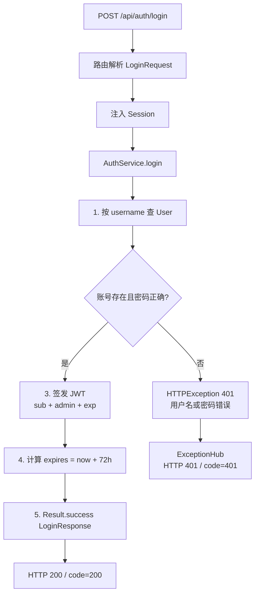
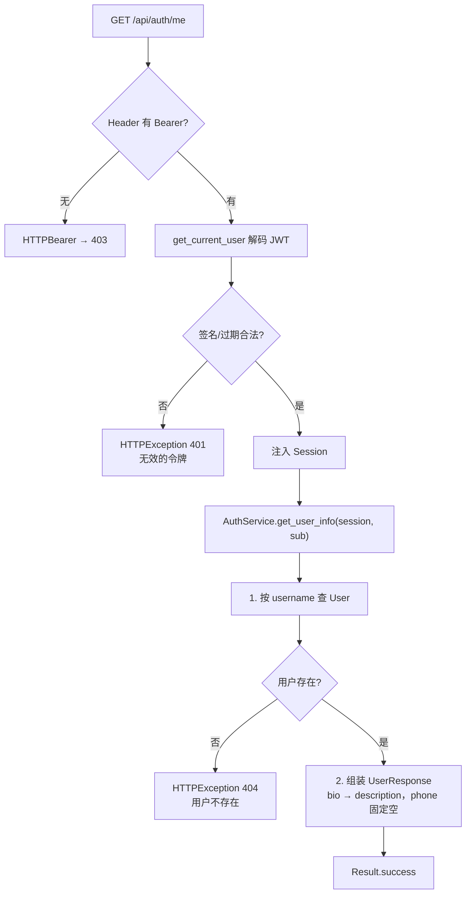
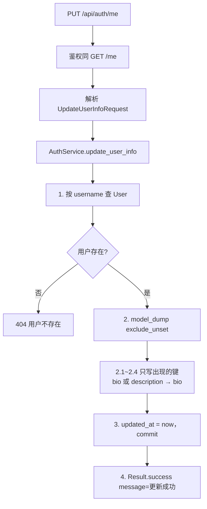

# 01 — 用户认证

> 对照源码：`app/api/AuthRouter.py`、`app/service/AuthService.py`、`app/schemas/AuthSchemas.py`、`app/utils/JWTUtils.py`、`app/Deps.py`、`app/models/User.py`
>
> Swagger tag：`用户认证模块`　前缀：`/api/auth`

管理员登录、取当前用户、改资料。前台访客 GitHub 登录不在本模块。

---

## 1. 模块说明

| 项 | 内容 |
|----|------|
| 表 | `user` |
| 鉴权 | `POST /login` 公开；`GET/PUT /me` 需管理员 JWT |
| 响应 | 统一 `{code, message, data}`，成功 `code=200` |
| 字段特例 | 令牌 JSON 为 camelCase；表字段 `bio` 对外叫 `description`；`phone` 表里没有，固定 `""` |

相关文件：

| 角色 | 文件 |
|------|------|
| 路由 | `app/api/AuthRouter.py` |
| 业务 | `app/service/AuthService.py` |
| DTO | `app/schemas/AuthSchemas.py` |
| 表 | `app/models/User.py` |
| JWT / 密码 | `app/utils/JWTUtils.py` |

---

## 2. 前后端交接规范

### 2.1 接口一览

| 方法 | 路径 | 鉴权 | 说明 |
|------|------|------|------|
| POST | `/api/auth/login` | 无 | 登录，签发 JWT |
| GET | `/api/auth/me` | 管理员 JWT | 当前用户资料 |
| PUT | `/api/auth/me` | 管理员 JWT | 更新资料，只改传入字段 |

### 2.2 POST `/api/auth/login`

登录。账号不存在与密码错误**同一句 401**，避免被枚举。`refreshToken` 暂未实现，恒为 `""`。

**请求** `application/json`

| 字段 | 类型 | 必填 | 说明 |
|------|------|------|------|
| username | string | 是 | 用户名 |
| password | string | 是 | 明文密码 |

```json
{ "username": "admin", "password": "admin123" }
```

**成功** HTTP 200

| data 字段 | JSON 名 | 类型 | 说明 |
|-----------|---------|------|------|
| access_token | accessToken | string | JWT，后续请求放 Header |
| refresh_token | refreshToken | string | 暂空 |
| expires | expires | datetime | UTC 过期时间，ISO 8601 |
| avatar | avatar | string | 头像 URL，空则 `""` |
| username | username | string | 用户名 |
| nickname | nickname | string | 空则回退为 username |
| roles | roles | string[] | `is_admin` 为真 `["admin"]`，否则 `[]` |
| permissions | permissions | string[] | 管理员 `["*:*:*"]`，否则 `[]` |

```json
{
  "code": 200,
  "message": "success",
  "data": {
    "accessToken": "<jwt>",
    "refreshToken": "",
    "expires": "2026-09-03T13:00:00+00:00",
    "avatar": "",
    "username": "admin",
    "nickname": "管理员",
    "roles": ["admin"],
    "permissions": ["*:*:*"]
  }
}
```

**失败**

| HTTP / code | message | 何时 |
|-------------|---------|------|
| 401 | 用户名或密码错误 | 账号不存在或密码不对 |
| 422 | 参数校验失败 | 缺字段或类型不对 |

前端：`code === 200` 才当成功；把 `data.accessToken` 存下来，请求 `/me` 等写接口时带：

```http
Authorization: Bearer <accessToken>
```

### 2.3 GET `/api/auth/me`

取当前登录管理员资料。用户名来自 JWT `sub`，不从 query/body 传。

**请求** 无 body。Header 必须带 Bearer Token。

**成功** HTTP 200，`data` 为用户资料（无令牌）：

| 字段 | 类型 | 说明 |
|------|------|------|
| avatar | string | 头像 |
| username | string | 用户名 |
| nickname | string | 空则回退为 username |
| email | string | 邮箱 |
| description | string | 简介，对应表字段 `bio` |
| phone | string | 固定 `""`（表无此列） |
| roles | string[] | 同登录 |
| permissions | string[] | 同登录 |

**失败**

| HTTP / code | message | 何时 |
|-------------|---------|------|
| 403 | Not authenticated | 未带 Token（HTTPBearer 默认） |
| 401 | 无效的令牌 | Token 过期、伪造、格式错 |
| 404 | 用户不存在 | Token 有效但用户已删 |

### 2.4 PUT `/api/auth/me`

更新当前用户。只更新请求里**出现的键**；不传的字段保持原值。`bio` 与 `description` 都写到表字段 `bio`。

**请求** 全部可选：

| 字段 | 类型 | 写到 |
|------|------|------|
| nickname | string \| null | nickname |
| email | string \| null | email |
| bio | string \| null | bio |
| description | string \| null | bio（与 bio 同义） |
| avatar | string \| null | avatar |

```json
{ "nickname": "新昵称", "description": "一句话简介" }
```

**成功** HTTP 200，无业务 data：

```json
{ "code": 200, "message": "更新成功", "data": null }
```

前端改完资料应再调一次 `GET /me` 刷新本地用户信息（本接口不回新资料）。

**失败** 同 GET `/me` 的 403 / 401 / 404。

---

## 3. 后端接口执行流程

请求进路由后：解析参数 → `Depends` 注入 Session / JWT → 调 service → 成功 `Result.success`；失败 `raise HTTPException`，由 `ExceptionHub` 转成同结构 JSON。

### 3.1 POST `/api/auth/login`



路由只拆字段传入，不查库：

```text
auth_service.login(session, LoginReq.username, LoginReq.password)
```

### 3.2 GET `/api/auth/me`



`current_user.get("sub")` 才是用户名；路由里不要自己解 Token。

### 3.3 PUT `/api/auth/me`



未出现的键不要赋 `None`，否则会把原值清空。
