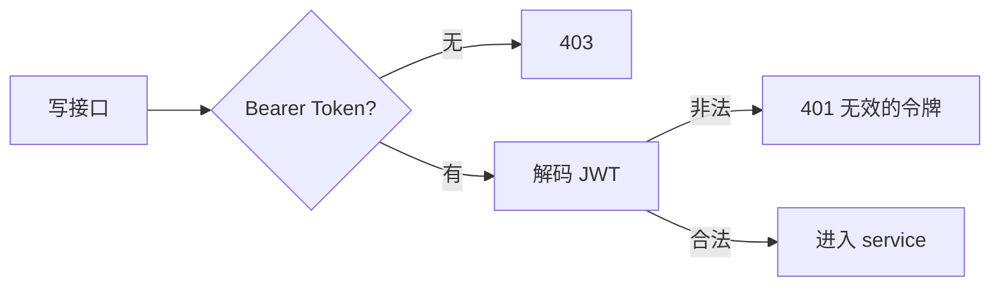
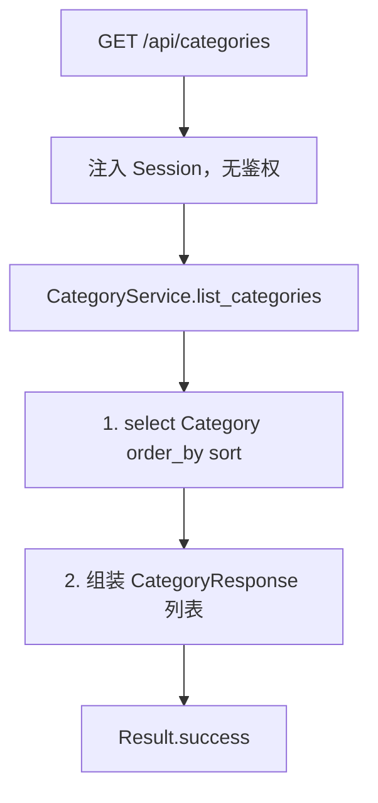
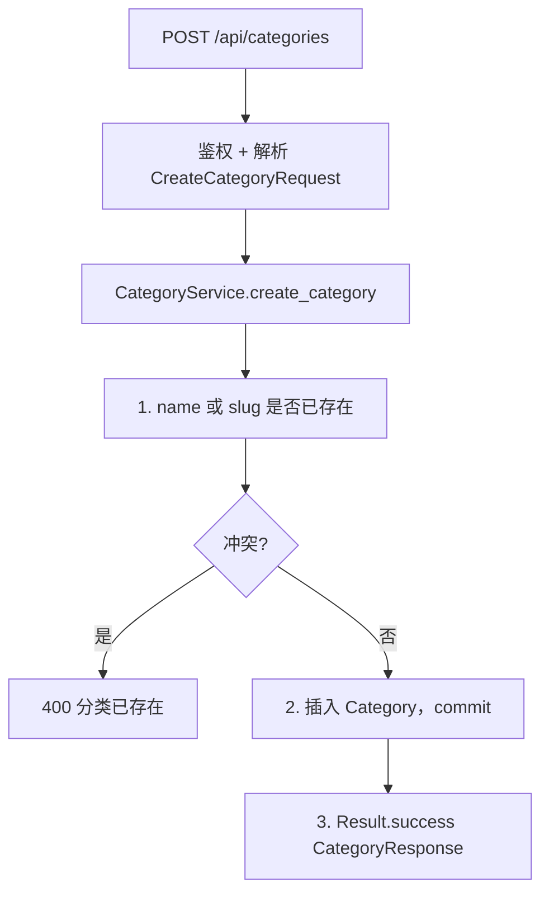
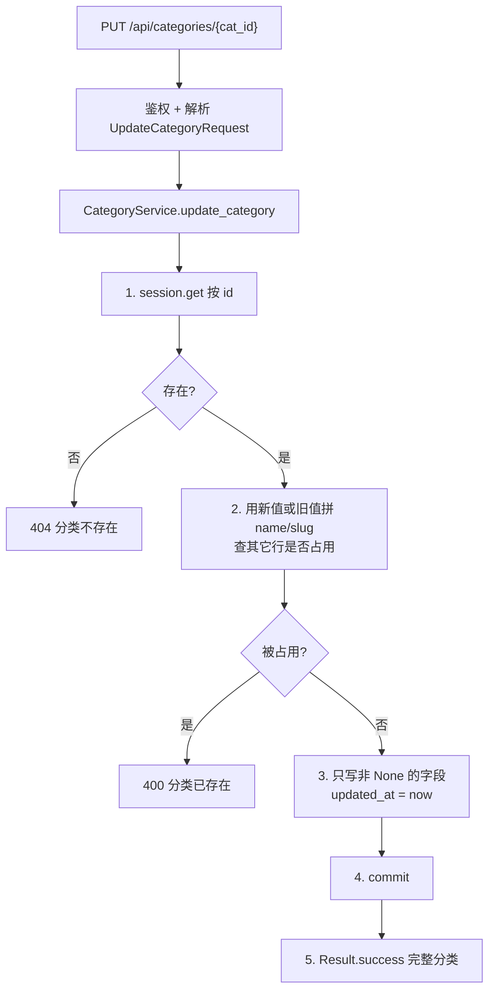
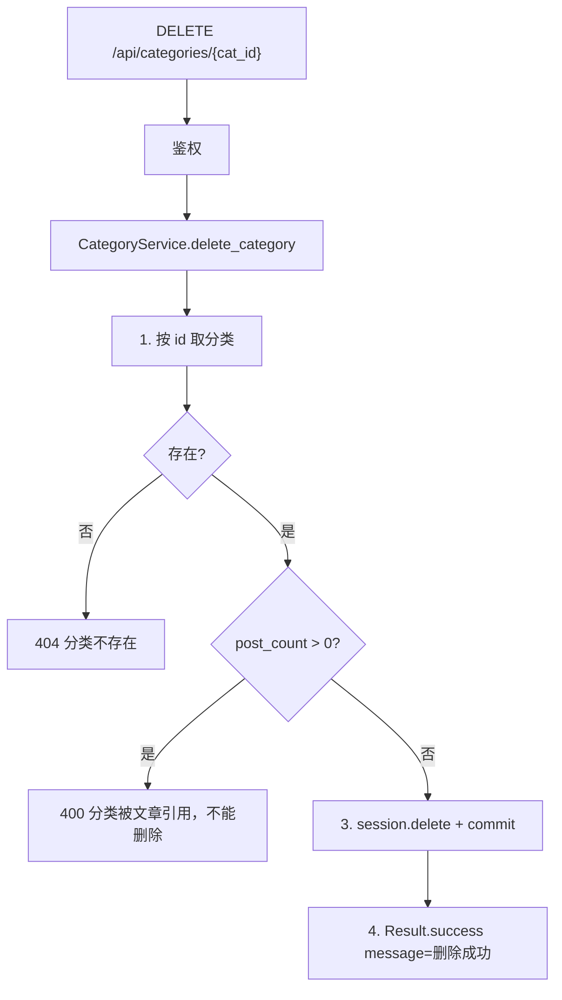

# 02 — 分类与标签

> 对照源码：`app/api/CategoriesRouter.py`、`app/service/CategoryService.py`、`app/schemas/CategorySchemas.py`、`app/models/Category.py`；标签对应 `TagsRouter` / `TagService` / `TagSchemas` / `Tag`
>
> Swagger tag：`分类模块`、`文章标签模块`　前缀：`/api/categories`、`/api/tags`

第一套完整 CRUD。读公开、写挂管理员 JWT。文章模块会维护两边的 `post_count`。

---

## 1. 模块说明

| 项 | 分类 | 标签 |
|----|------|------|
| 表 | `category` | `tag` |
| 列表排序 | `sort` 升序 | `id` 正序 |
| 独有字段 | `description`、`sort`、`created_at`、`updated_at` | 无 |
| 共用字段 | `id`、`name`（唯一）、`slug`（唯一）、`post_count` | 同左 |
| 删除限制 | `post_count > 0` 不可删 | 同左 |

`slug` 给前台路径用（如 `/category/python`），不要当主键；增删改仍走整数 `id`。

JSON 字段目前为 **snake_case**（`post_count`、`created_at`），与认证模块的 `accessToken` 不同。

相关文件：

| 角色 | 分类 | 标签 |
|------|------|------|
| 路由 | `app/api/CategoriesRouter.py` | `app/api/TagsRouter.py` |
| 业务 | `app/service/CategoryService.py` | `app/service/TagService.py` |
| DTO | `app/schemas/CategorySchemas.py` | `app/schemas/TagSchemas.py` |
| 表 | `app/models/Category.py` | `app/models/Tag.py` |

---

## 2. 前后端交接规范

### 2.1 接口一览

| 方法 | 路径 | 鉴权 | 说明 |
|------|------|------|------|
| GET | `/api/categories` | 无 | 全部分类，按 sort 升序 |
| POST | `/api/categories` | 管理员 JWT | 创建 |
| PUT | `/api/categories/{cat_id}` | 管理员 JWT | 更新，只改传入字段 |
| DELETE | `/api/categories/{cat_id}` | 管理员 JWT | 删除 |
| GET | `/api/tags` | 无 | 全部标签，按 id 正序 |
| POST | `/api/tags` | 管理员 JWT | 创建 |
| PUT | `/api/tags/{tag_id}` | 管理员 JWT | 更新，只改传入字段 |
| DELETE | `/api/tags/{tag_id}` | 管理员 JWT | 删除 |

路径参数 `cat_id` / `tag_id` 是整数主键。未带 Token 调写接口 → **403**；Token 无效 → **401** `无效的令牌`。

### 2.2 分类 — 列表 / 创建 / 更新 / 删除

#### GET `/api/categories`

公开。无 query。成功 `data` 为数组（可空 `[]`）。

**data[] 字段（CategoryResponse）**

| 字段 | 类型 | 说明 |
|------|------|------|
| id | int | 主键 |
| name | string | 名称 |
| slug | string | URL 别名 |
| description | string | 描述，空则 `""` |
| sort | int | 越小越靠前 |
| post_count | int | 该分类下文章数（文章模块维护） |
| created_at | datetime | ISO 8601 |
| updated_at | datetime | ISO 8601 |

```json
{
  "code": 200,
  "message": "success",
  "data": [
    {
      "id": 1,
      "name": "Python",
      "slug": "python",
      "description": "",
      "sort": 0,
      "post_count": 0,
      "created_at": "2026-08-31T12:00:00",
      "updated_at": "2026-08-31T12:00:00"
    }
  ]
}
```

#### POST `/api/categories`

**请求**

| 字段 | 类型 | 必填 | 默认 | 说明 |
|------|------|------|------|------|
| name | string | 是 | | 唯一 |
| slug | string | 是 | | 唯一，前台路径用 |
| description | string | 否 | `""` | |
| sort | int | 否 | `0` | 越小越靠前 |

```json
{ "name": "Python", "slug": "python", "description": "", "sort": 0 }
```

**成功** HTTP 200，`data` 为刚创建的分类（结构同列表单项，`post_count` 为 0）。

**失败**

| HTTP / code | message | 何时 |
|-------------|---------|------|
| 400 | 分类已存在 | name 或 slug 已被占用 |
| 403 / 401 | 见全局约定 | 未登录 / Token 无效 |
| 422 | 参数校验失败 | 缺 name/slug 等 |

#### PUT `/api/categories/{cat_id}`

字段全部可选，不传则不改。name / slug 改完后仍须全局唯一（排除自身）。

| 字段 | 类型 | 说明 |
|------|------|------|
| name | string \| null | 不传不改 |
| slug | string \| null | 不传不改 |
| description | string \| null | 不传不改 |
| sort | int \| null | 不传不改 |

```json
{ "sort": 1 }
```

只传 `sort` 时，name / slug / description 保持原值。

**成功** HTTP 200，`data` 为更新后的完整分类。

**失败** 另有：

| HTTP / code | message | 何时 |
|-------------|---------|------|
| 404 | 分类不存在 | id 对不上 |
| 400 | 分类已存在 | 新 name/slug 被其它分类占用 |

#### DELETE `/api/categories/{cat_id}`

无 body。仍有文章占用（`post_count > 0`）不允许删，避免文章变成无分类。

**成功**

```json
{ "code": 200, "message": "删除成功", "data": null }
```

**失败**

| HTTP / code | message | 何时 |
|-------------|---------|------|
| 404 | 分类不存在 | id 对不上 |
| 400 | 分类被文章引用，不能删除 | post_count > 0 |

前端：删之前看列表里的 `post_count`；为 0 再调删除。成功后从本地列表去掉该项，不要指望本接口回列表。

### 2.3 标签 — 列表 / 创建 / 更新 / 删除

规则与分类相同：读公开、写 JWT；name/slug 唯一；`post_count > 0` 不能删。差别：

- 没有 `description` / `sort` / `created_at` / `updated_at`
- 列表按 `id` 正序，不是 sort
- 更新冲突文案是「标签被占用」，创建冲突是「标签已存在」

#### GET `/api/tags`

**data[] 字段（TagResponse）**

| 字段 | 类型 | 说明 |
|------|------|------|
| id | int | 主键 |
| name | string | 名称 |
| slug | string | URL 别名 |
| post_count | int | 使用该标签的文章数 |

#### POST `/api/tags`

| 字段 | 类型 | 必填 |
|------|------|------|
| name | string | 是 |
| slug | string | 是 |

成功 `data` 为刚创建的标签，`post_count` 为 0。冲突 → 400 `标签已存在`。

#### PUT `/api/tags/{tag_id}`

| 字段 | 类型 | 说明 |
|------|------|------|
| name | string \| null | 不传不改 |
| slug | string \| null | 不传不改 |

成功回完整标签。不存在 → 404 `标签不存在`；name/slug 被其它标签占用 → 400 `标签被占用`。

#### DELETE `/api/tags/{tag_id}`

成功 `{code: 200, message: "删除成功", data: null}`。

| HTTP / code | message | 何时 |
|-------------|---------|------|
| 404 | 标签不存在 | id 对不上 |
| 400 | 标签被文章引用，不能删除 | post_count > 0 |

---

## 3. 后端接口执行流程

分类与标签步骤同构。下面画分类四条；标签把「分类」换成「标签」，列表排序改为 `order_by(Tag.id)`，更新冲突文案为「标签被占用」。

鉴权写接口共用：



`current_user` 只用来卡登录，本模块函数体不读 payload。

### 3.1 GET `/api/categories`



标签：`TagService.get_tags` → `order_by(Tag.id)` → 表字段与 `TagResponse` 能对上，直接 `Result.success(list(rows))`。

### 3.2 POST `/api/categories`



标签同结构：冲突文案「标签已存在」；创建只写 `name`、`slug`。

### 3.3 PUT `/api/categories/{cat_id}`



客户端只传 `{ "sort": 1 }` 时，不要把 name 写成 None。标签无 `updated_at`，更新冲突为「标签被占用」。

### 3.4 DELETE `/api/categories/{cat_id}`



本阶段 `post_count` 默认 0；文章模块写完后，删分类/标签必须先看这个计数，不要直接 `ON DELETE CASCADE`。
