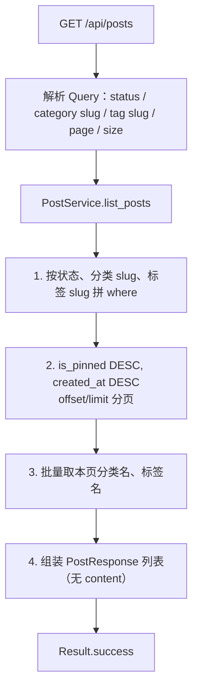
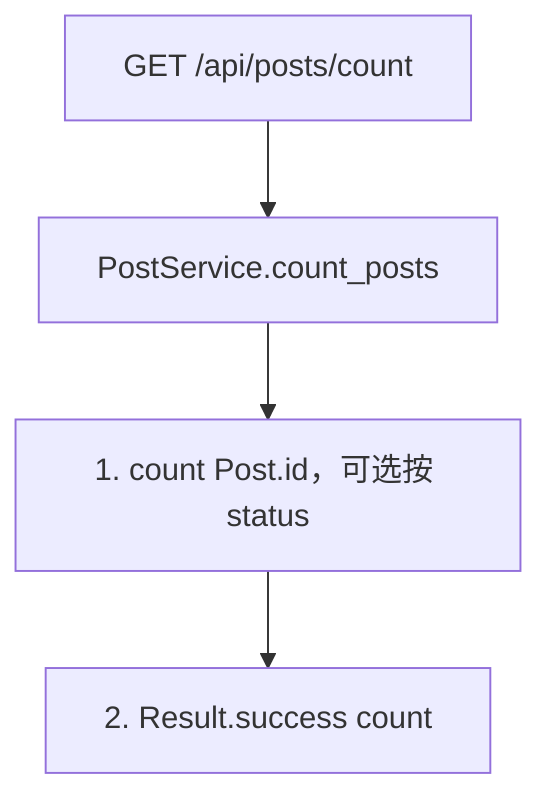
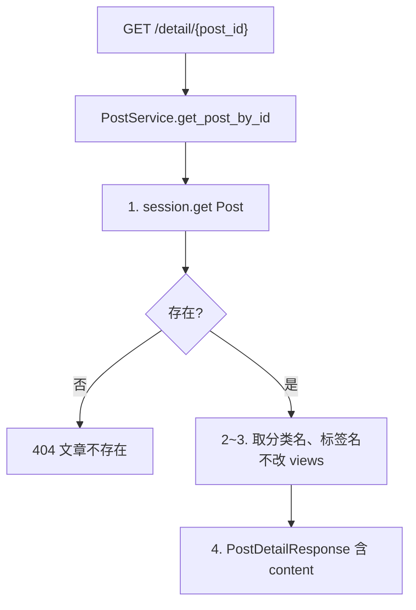
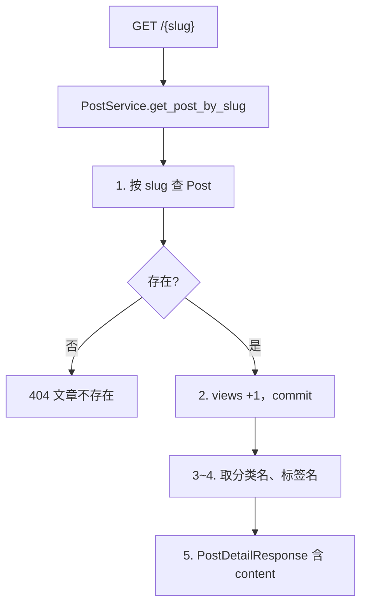
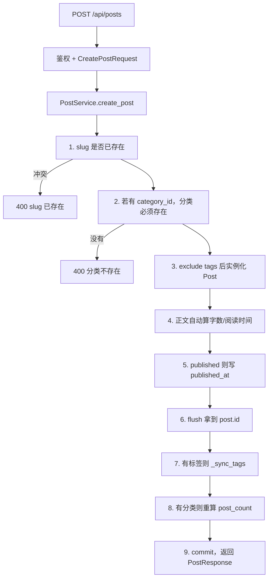
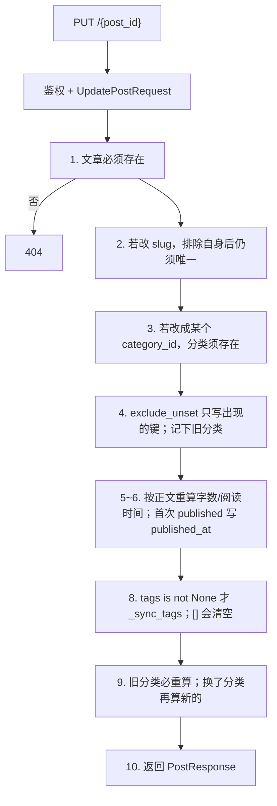
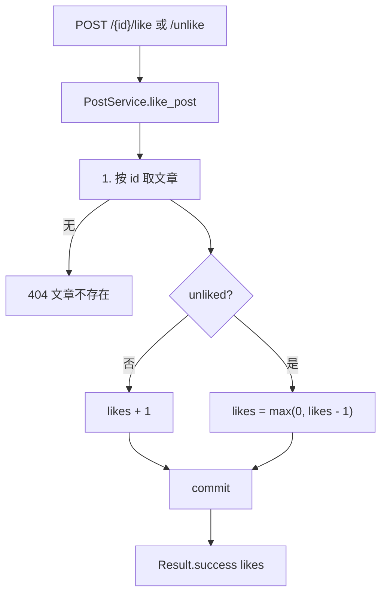
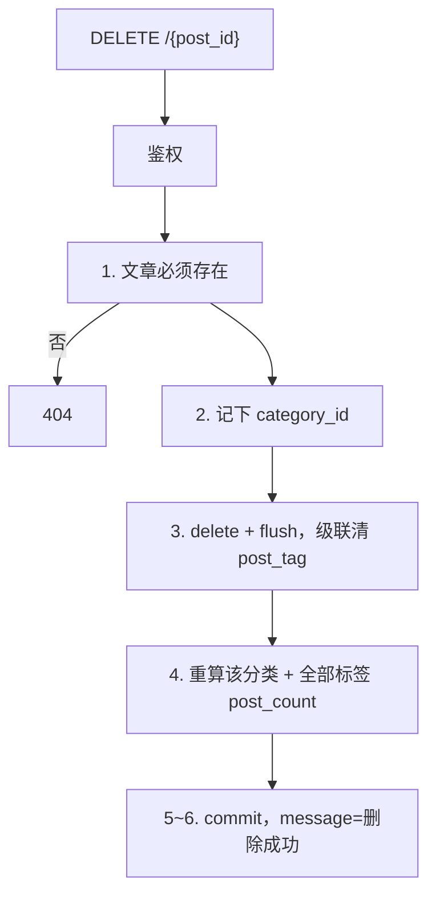

# 03 — 文章模块

> 对照源码：`app/api/PostsApi.py`、`app/service/PostService.py`、`app/schemas/PostSchemas.py`、`app/models/Post.py`、`app/models/PostTag.py`
>
> Swagger tag：`文章模块`　前缀：`/api/posts`

博客核心：列表/详情、CRUD、点赞。分类、标签的 `post_count` 由本模块增删改时重算。

---

## 1. 模块说明

| 项 | 内容 |
|----|------|
| 表 | `post`；多对多中间表 `post_tag` |
| 鉴权 | 读、点赞/取消点赞公开；创建/更新/删除需管理员 JWT |
| 列表/创建/更新出参 | `PostResponse`，**不含正文** |
| 详情出参 | `PostDetailResponse`，多一个 `content` |
| 响应里的分类/标签 | `category` 是分类**名称**（无则 `""`）；`tags` 是标签**名称**列表。不是 id |
| 请求里的分类/标签 | 写入用 `category_id`（int）；`tags` 是标签**名称**。筛选列表时 `category`/`tag` 是 **slug** |

**路由顺序（必须）**：静态路径写在 `/{slug}` 前面，否则 `count`、`detail` 会被当成 slug。

```
GET    /api/posts
GET    /api/posts/count
GET    /api/posts/detail/{post_id}
GET    /api/posts/{slug}          ← 放最后一条 GET
POST   /api/posts
PUT    /api/posts/{post_id}
POST   /api/posts/{post_id}/like
POST   /api/posts/{post_id}/unlike
DELETE /api/posts/{post_id}
```

相关文件：

| 角色 | 文件 |
|------|------|
| 路由 | `app/api/PostsApi.py` |
| 业务 | `app/service/PostService.py` |
| DTO | `app/schemas/PostSchemas.py` |
| 表 | `app/models/Post.py`、`app/models/PostTag.py` |

状态取值：`draft` / `published` / `archived`。JSON 为 snake_case。

---

## 2. 前后端交接规范

### 2.1 接口一览

| 方法 | 路径 | 鉴权 | 说明 |
|------|------|------|------|
| GET | `/api/posts` | 无 | 分页列表，不含正文 |
| GET | `/api/posts/count` | 无 | 按状态计数 |
| GET | `/api/posts/detail/{post_id}` | 无 | 后台按 id 取详情，含正文，不加工量 |
| GET | `/api/posts/{slug}` | 无 | 前台按 slug 取详情，含正文，浏览量 +1 |
| POST | `/api/posts` | 管理员 JWT | 创建 |
| PUT | `/api/posts/{post_id}` | 管理员 JWT | 更新，只改传入字段 |
| POST | `/api/posts/{post_id}/like` | 无 | 点赞，likes +1 |
| POST | `/api/posts/{post_id}/unlike` | 无 | 取消点赞，likes -1（最小 0） |
| DELETE | `/api/posts/{post_id}` | 管理员 JWT | 删除 |

### 2.2 列表 / 计数共用的 `PostResponse`

列表、创建、更新成功时的 `data`（列表是数组，后两个是对象）。**没有 `content`。**

| 字段 | 类型 | 说明 |
|------|------|------|
| id | int | 主键 |
| title | string | 标题 |
| slug | string | URL 别名 |
| description | string | 摘要 |
| cover | string | 封面 URL |
| category | string | 分类名称，无分类为 `""` |
| tags | string[] | 标签名称 |
| status | string | draft / published / archived |
| is_pinned | bool | 是否置顶 |
| views | int | 浏览量 |
| likes | int | 点赞数 |
| word_count | int | 字数 |
| reading_time | int | 预计阅读分钟数 |
| published_at | datetime \| null | 首次发布时间；草稿为 `null` |
| created_at | datetime | |
| updated_at | datetime | |

### 2.3 GET `/api/posts`

公开。排序：置顶优先，再按 `created_at` 降序。

**Query**

| 参数 | 类型 | 默认 | 说明 |
|------|------|------|------|
| status | string | 不传=全部 | draft / published / archived |
| category | string | 不传=不限 | **分类 slug**，不是 id、不是 name |
| tag | string | 不传=不限 | **标签 slug** |
| page | int | 1 | `ge=1` |
| size | int | 10 | `ge=1`，最大 200 |

```http
GET /api/posts?status=published&category=python&page=1&size=10
```

**成功** HTTP 200，`data` 为 `PostResponse[]`（可空）。无分页 meta（总条数走 `/count`）。

### 2.4 GET `/api/posts/count`

公开。Query 仅 `status`（可选）。不按分类/标签筛。

**成功**

```json
{ "code": 200, "message": "success", "data": { "count": 3 } }
```

### 2.5 GET `/api/posts/detail/{post_id}`

后台编辑页：按主键取，含 `content`，**不**增加 `views`。不存在 → 404 `文章不存在`。

`data` = `PostResponse` 全部字段 + `content`（Markdown 字符串）。

### 2.6 GET `/api/posts/{slug}`

前台展示页：按 slug 取，含 `content`，每次成功访问 **views +1**。不存在 → 404 `文章不存在`。

前端：编辑走 `/detail/{id}`；读者打开文章走 `/{slug}`。不要用 slug 接口给后台预览（会刷浏览量）。

### 2.7 POST `/api/posts`

**请求**

| 字段 | 类型 | 必填 | 默认 | 说明 |
|------|------|------|------|------|
| title | string | 是 | | |
| slug | string | 是 | | 全站唯一 |
| description | string | 否 | `""` | |
| content | string | 否 | `""` | Markdown |
| cover | string | 否 | `""` | |
| category_id | int \| null | 否 | `null` | 分类主键；不传则无分类。传了必须存在 |
| tags | string[] | 否 | `[]` | **标签名称**，没有则按名创建 |
| status | string | 否 | `draft` | draft / published / archived |
| is_pinned | bool | 否 | `false` | |
| reading_time | int | 否 | `0` | `0` 且有正文时按字数自动算 |
| word_count | int | 否 | `0` | `0` 且有正文时按 `len(content)` |

```json
{
  "title": "第一篇文章",
  "slug": "hello-world",
  "content": "正文",
  "category_id": 1,
  "tags": ["Python", "FastAPI"],
  "status": "published"
}
```

自动字段：

- 有正文且 `word_count` 为 0 → `word_count = len(content)`
- 有正文且 `reading_time` 为 0 → `max(1, word_count // 300)`（约 300 字/分钟）
- `status=published` 且尚无 `published_at` → 写入当前时间

新建标签时 `slug = name.lower().replace(" ", "-")`。名称没有但该 slug 已被占用 → 400 `标签已存在`。

**成功** HTTP 200，`data` 为 `PostResponse`（不含正文）。

**失败**

| HTTP / code | message | 何时 |
|-------------|---------|------|
| 400 | slug 已存在 | slug 冲突 |
| 400 | 分类不存在 | category_id 对不上 |
| 400 | 标签已存在 | 自动建标签时 slug 被占用 |
| 403 / 401 | 见全局约定 | 未登录 / Token 无效 |
| 422 | 参数校验失败 | 缺 title/slug 等 |

### 2.8 PUT `/api/posts/{post_id}`

全部可选。不传的字段保持原值。

| 字段 | 不传 | 传值 | 传 `null` / `[]` |
|------|------|------|------------------|
| title / slug / description / content / cover / status / is_pinned | 不改 | 覆盖 | — |
| category_id | 不改 | 换成该分类（必须存在） | 去掉分类 |
| tags | 不改 | 按名称全量覆盖 | `[]` 清空标签 |
| word_count / reading_time | 有正文则按正文重算 | 用传入值 | — |

slug 改完仍须全站唯一（排除自身）。首次变成 `published` 才写 `published_at`，已有值不覆盖。

**成功** `data` 为更新后的 `PostResponse`（不含正文）。

**失败** 另有：404 `文章不存在`；400 `slug 已存在` / `分类不存在` / `标签已存在`。

### 2.9 POST `/api/posts/{post_id}/like` 与 `/unlike`

公开，无 body。文章不存在 → 404 `文章不存在`。

- like：`likes + 1`
- unlike：`likes - 1`，最小为 0（不会变负数）

**成功**

```json
{ "code": 200, "message": "success", "data": { "likes": 4 } }
```

不做登录去重：同一人可反复点赞。前端若要防刷需自己限制。

### 2.10 DELETE `/api/posts/{post_id}`

需管理员 JWT。不存在 → 404。删后重算所属分类和**全部**标签的 `post_count`（中间表级联删关联行）。

**成功**

```json
{ "code": 200, "message": "删除成功", "data": null }
```

---

## 3. 后端接口执行流程

写接口鉴权同分类模块：无 Bearer → 403；Token 非法 → 401。`current_user` 只卡登录，本模块不读 payload。

### 3.1 GET `/api/posts`



### 3.2 GET `/api/posts/count`



### 3.3 GET `/api/posts/detail/{post_id}`



### 3.4 GET `/api/posts/{slug}`



### 3.5 POST `/api/posts`



`_sync_tags`：先删该文全部 `PostTag` → 按名称找/建 Tag（slug 冲突则 400）→ 写新关联 → 整表重算标签 `post_count`。

### 3.6 PUT `/api/posts/{post_id}`



`category_id` 显式传 `null` 会去掉分类（字段已 set）；完全不传则不改。

### 3.7 点赞 / 取消点赞



### 3.8 DELETE `/api/posts/{post_id}`


