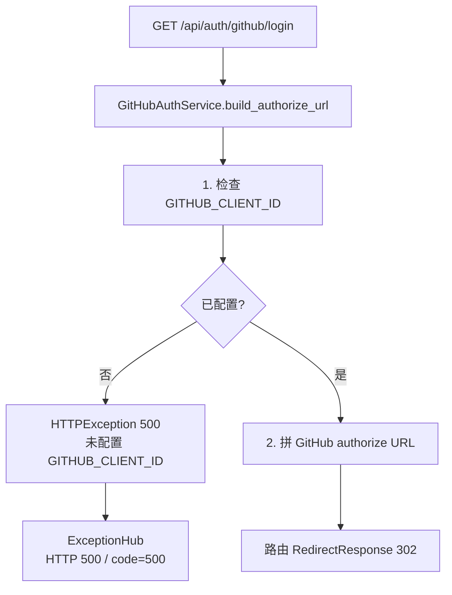
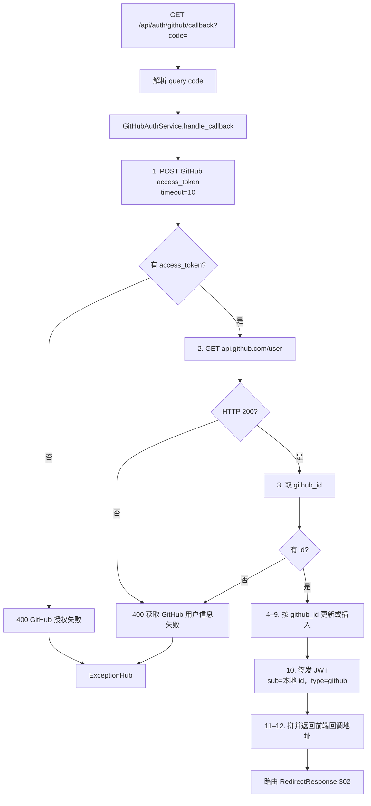
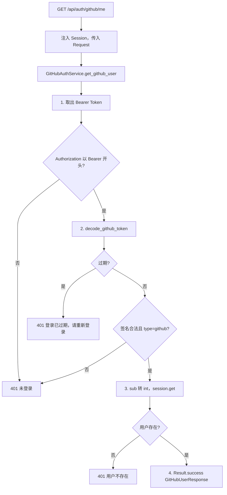
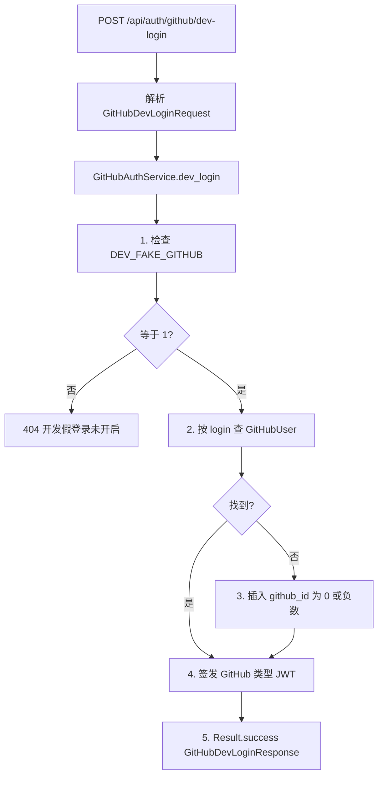

# 04 — GitHub 登录

> 对照源码：`app/api/GitHubAuthRouter.py`、`app/service/GitHubAuthService.py`、`app/schemas/GitHubAuthSchemas.py`、`app/models/GitHubUser.py`、`app/utils/JWTUtils.py`、`app/Deps.py`
>
> Swagger tag：`GitHub 登录`　前缀：`/api/auth/github`

前台访客用 GitHub OAuth 登录，签发与管理员分开的 JWT。不含管理员账号密码登录（见 01）。

## 1. 模块说明

| 项 | 内容 |
|----|------|
| 表 | `github_user`（类名 `GitHubUser`，必须显式 `__tablename__`） |
| 鉴权 | `/login`、`/callback`、`/dev-login` 公开；`GET /me` 需 **GitHub JWT** |
| 响应 | `/me`、`/dev-login` 走统一 `{code, message, data}`，成功 `code=200`；`/login`、`/callback` 成功是 **302**，不是 Result |
| JWT | 同一 `SECRET_KEY`。payload：`sub`（**本地主键**字符串）、`login`、`type: "github"`、`exp`。不要把 GitHub 的数字 id 写进 `sub` |
| Header | 本模块手动读 `Authorization`，不用 `HTTPBearer`。缺 Bearer → **401** `未登录`（不是管理员那套 403） |

`GITHUB_CLIENT_ID` / `GITHUB_CLIENT_SECRET` 未配时 `/login` 直接 500。`FRONTEND_ORIGIN` 默认 `http://localhost:3000`，callback 成功后跳 `{FRONTEND_ORIGIN}/auth/callback?token=`。

`DEV_FAKE_GITHUB=1` 时才开放假登录，生产不要开。

相关文件：

| 角色 | 文件 |
|------|------|
| 路由 | `app/api/GitHubAuthRouter.py` |
| 业务 | `app/service/GitHubAuthService.py` |
| DTO | `app/schemas/GitHubAuthSchemas.py` |
| 表 | `app/models/GitHubUser.py` |
| JWT | `app/utils/JWTUtils.py` 的 `decode_github_token` / `try_decode_github_token` |

阶段 07 评论会用：

```python
from app.Deps import get_github_user_optional
```

`get_github_user_optional`：没有 Bearer 或解码失败 → `None`，不抛错。

---

## 2. 前后端交接规范

### 2.1 接口一览

| 方法 | 路径 | 鉴权 | 说明 |
|------|------|------|------|
| GET | `/api/auth/github/login` | 无 | 302 到 GitHub 授权页 |
| GET | `/api/auth/github/callback` | 无 | Query `code`；换票落库后 302 回前端 |
| GET | `/api/auth/github/me` | GitHub JWT | 当前访客资料 |
| POST | `/api/auth/github/dev-login` | 无 | 仅 `DEV_FAKE_GITHUB=1`，签发测试 JWT |

GitHub OAuth App 的 Authorization callback URL 填：

```
http://localhost:8000/api/auth/github/callback
```

前端：用户点登录 → 打开 `/api/auth/github/login`（整页跳转即可）→ GitHub 同意 → 后端 callback → 浏览器落到 `/auth/callback?token=` → 把 `token` 存下来，之后请求带：

```http
Authorization: Bearer <token>
```

不要用管理员 `accessToken` 调本模块 `/me`。

### 2.2 GET `/api/auth/github/login`

公开。无 query、无 body。

**成功** HTTP **302**，`Location`：

```
https://github.com/login/oauth/authorize?client_id={GITHUB_CLIENT_ID}&scope=read:user
```

**失败**

| HTTP / code | message | 何时 |
|-------------|---------|------|
| 500 | 未配置 GITHUB_CLIENT_ID | 环境变量为空 |

### 2.3 GET `/api/auth/github/callback`

GitHub 授权后带回 `code`。

**请求** Query

| 字段 | 类型 | 必填 | 说明 |
|------|------|------|------|
| code | string | 是 | GitHub 授权码 |

**成功** HTTP **302**，`Location`：

```
{FRONTEND_ORIGIN}/auth/callback?token={jwt}
```

`token` 已做 query 编码。前端从 URL 取 token，不要指望本接口返回 JSON。

**失败**（走 Result 信封）

| HTTP / code | message | 何时 |
|-------------|---------|------|
| 400 | GitHub 授权失败 | 换票失败、无 `access_token`、网络错误 |
| 400 | 获取 GitHub 用户信息失败 | GitHub `/user` 非 200，或没有 `id` |
| 422 | 参数校验失败 | 缺 `code` |

### 2.4 GET `/api/auth/github/me`

当前 GitHub 访客。用户名来自 JWT，不从 query/body 传。

**请求** 无 body。Header 必须是 `Authorization: Bearer <GitHub JWT>`（前缀含空格）。

**成功** HTTP 200

| data 字段 | 类型 | 说明 |
|-----------|------|------|
| id | int | 本地表主键（评论外键用这个） |
| login | string | GitHub 用户名 |
| avatar | string | 头像 URL，空则 `""` |
| bio | string | 简介，空则 `""` |

```json
{
  "code": 200,
  "message": "success",
  "data": {
    "id": 1,
    "login": "octocat",
    "avatar": "https://avatars.githubusercontent.com/u/1",
    "bio": ""
  }
}
```

**失败**

| HTTP / code | message | 何时 |
|-------------|---------|------|
| 401 | 未登录 | 没带 Bearer、Token 伪造/格式错、`type` 不是 `github`（含管理员 Token） |
| 401 | 登录已过期，请重新登录 | Token 过期 |
| 401 | 用户不存在 | Token 有效但本地用户已删 |

### 2.5 POST `/api/auth/github/dev-login`

只给本地自测。`DEV_FAKE_GITHUB` 不是 `1` 时 **404**。按 `login` 找到就复用，找不到就插入 `github_id <= 0` 的测试行，返回正式 callback 同款 JWT（JSON，不 redirect）。

**请求** `application/json`

| 字段 | 类型 | 必填 | 说明 |
|------|------|------|------|
| login | string | 是 | 测试用户名 |

```json
{ "login": "tester" }
```

**成功** HTTP 200

| data 字段 | JSON 名 | 类型 | 说明 |
|-----------|---------|------|------|
| access_token | accessToken | string | GitHub 类型 JWT |
| id | id | int | 本地主键 |
| login | login | string | 用户名 |
| avatar | avatar | string | 测试用户一般为 `""` |
| bio | bio | string | 测试用户一般为 `""` |

```json
{
  "code": 200,
  "message": "success",
  "data": {
    "accessToken": "<jwt>",
    "id": 1,
    "login": "tester",
    "avatar": "",
    "bio": ""
  }
}
```

**失败**

| HTTP / code | message | 何时 |
|-------------|---------|------|
| 404 | 开发假登录未开启 | `DEV_FAKE_GITHUB` 不是 `1` |
| 422 | 参数校验失败 | 缺 `login` |

---

## 3. 后端接口执行流程

`/login`、`/callback` 成功返回 `RedirectResponse`（302）。`/me`、`/dev-login` 成功 `Result.success`；失败 `raise HTTPException`，由 `ExceptionHub` 转成同结构 JSON。

GitHub JWT 不用 `get_current_user`（那是 `HTTPBearer`，缺 Token 会 403）。`/me` 把 `Request` 传进 service，在 `get_github_user` 里读 Authorization。

### 3.1 GET `/api/auth/github/login`



### 3.2 GET `/api/auth/github/callback`



换票或拉用户遇网络错误 / 非 JSON，同样 400 `GitHub 授权失败`。

### 3.3 GET `/api/auth/github/me`



管理员 Token 能解码但没有 `type: github`，走 401 `未登录`。

### 3.4 POST `/api/auth/github/dev-login`


