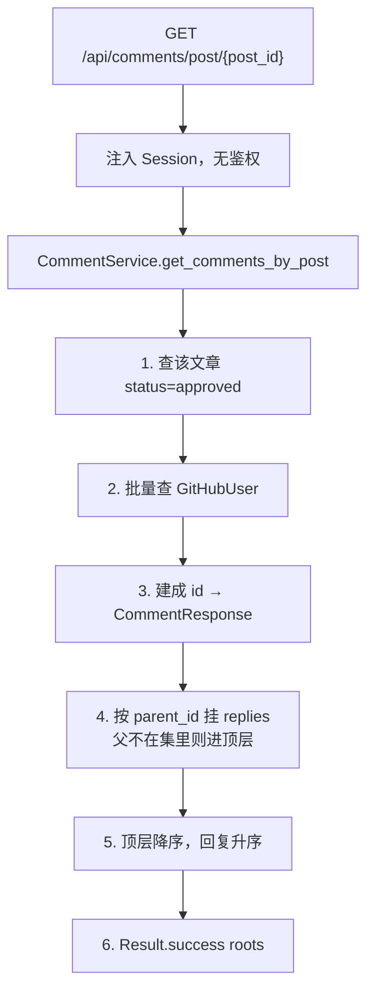
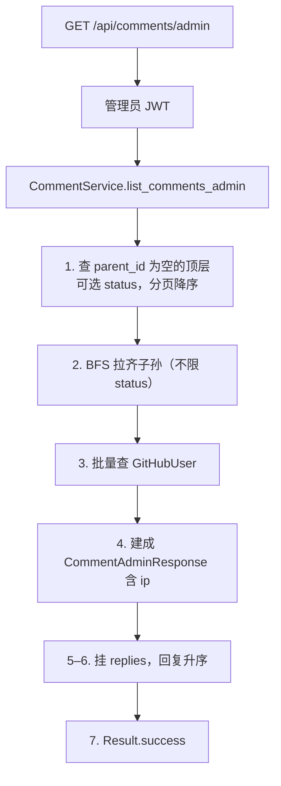
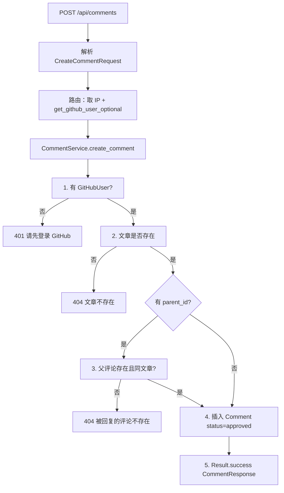
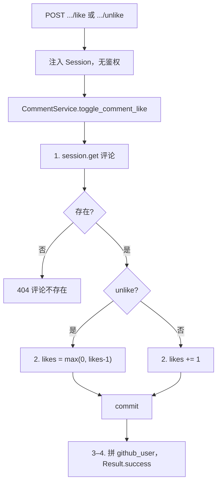
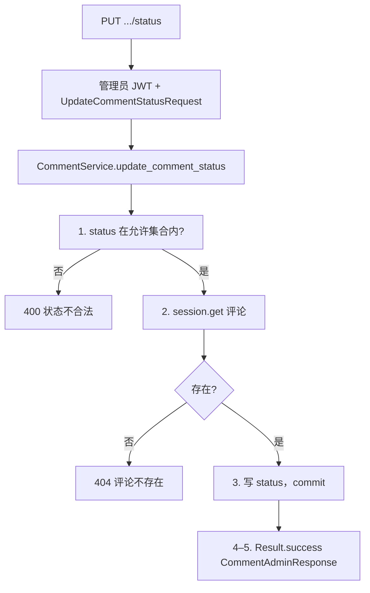
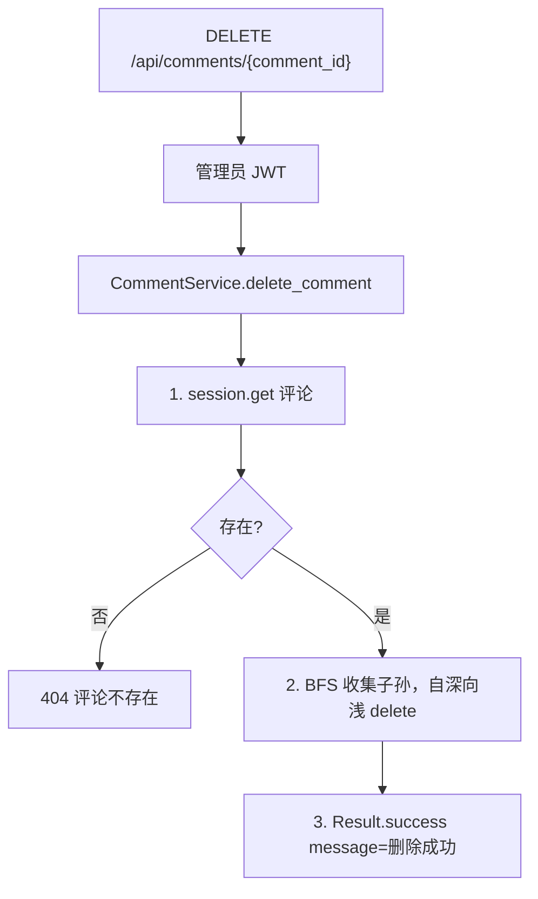

# 05 — 评论

> 对照源码：`app/api/CommentRouter.py`、`app/service/CommentService.py`、`app/schemas/CommentSchemas.py`、`app/models/Comment.py`
>
> Swagger tag：`评论`　前缀：`/api/comments`

文章下的访客评论树。读公开；发表须 GitHub JWT。留言板另表，不在本模块。

## 1. 模块说明

| 项 | 内容 |
|----|------|
| 表 | `comment` |
| 鉴权 | `GET /post/{post_id}`、点赞/取消点赞公开；`POST /` 需 GitHub JWT；`GET /admin` 需管理员 JWT |
| 响应 | 统一 `{code, message, data}`，成功 `code=200` |
| 树 | `parent_id` 自引用；出参嵌套 `replies`。前台 Out **不含** `ip`；管理端 `CommentAdminResponse` **含** `ip` |
| 状态 | 发表默认 `approved`；前台列表只返回 `approved` |
| 排序 | 顶层 `created_at` 降序；同一父下的回复升序 |

相关文件：

| 角色 | 文件 |
|------|------|
| 路由 | `app/api/CommentRouter.py` |
| 业务 | `app/service/CommentService.py` |
| DTO | `app/schemas/CommentSchemas.py` |
| 表 | `app/models/Comment.py` |
| 访客鉴权 | `get_github_user_optional`（`Deps` / `GitHubAuthService`） |

父评论不在本次结果集（例如父是 `rejected`）时，子评论会进顶层，成为「假根」。

---

## 2. 前后端交接规范

### 2.1 接口一览

| 方法 | 路径 | 鉴权 | 说明 |
|------|------|------|------|
| GET | `/api/comments/post/{post_id}` | 无 | 该文章已审核评论树 |
| GET | `/api/comments/admin` | 管理员 JWT | 顶层分页，含 IP 与 replies |
| POST | `/api/comments` | GitHub JWT | 发表 / 回复 |
| POST | `/api/comments/{comment_id}/like` | 无 | likes +1 |
| POST | `/api/comments/{comment_id}/unlike` | 无 | likes -1，最小 0 |
| PUT | `/api/comments/{comment_id}/status` | 管理员 JWT | 改审核状态 |
| DELETE | `/api/comments/{comment_id}` | 管理员 JWT | 删评论（含子孙） |

**路由顺序**：`/admin` 写在 `/{comment_id}/...` 之前。

### 2.2 GET `/api/comments/post/{post_id}`

公开。路径参数 `post_id` 为文章主键。文章不存在或没有任何已审核评论时，`data` 为 `[]`。

**data[] 字段（CommentResponse）**

| 字段 | 类型 | 说明 |
|------|------|------|
| id | int | 主键 |
| post_id | int | 所属文章 |
| parent_id | int \| null | 父评论；顶层为 `null` |
| content | string | 正文 |
| likes | int | 点赞数 |
| status | string | 本接口恒为 `approved` |
| created_at | datetime | ISO 8601 |
| github_user | object \| null | 评论者；用户已删为 `null` |
| replies | CommentResponse[] | 子回复，结构同本对象 |

**github_user 字段**

| 字段 | 类型 | 说明 |
|------|------|------|
| id | int | 本地 `github_user.id` |
| login | string | GitHub 用户名 |
| avatar | string | 头像，空则 `""` |
| bio | string | 简介，空则 `""` |

```json
{
  "code": 200,
  "message": "success",
  "data": [
    {
      "id": 1,
      "post_id": 10,
      "parent_id": null,
      "content": "写得好",
      "likes": 0,
      "status": "approved",
      "created_at": "2026-09-02T10:00:00",
      "github_user": {
        "id": 1,
        "login": "octocat",
        "avatar": "https://avatars.githubusercontent.com/u/1",
        "bio": ""
      },
      "replies": []
    }
  ]
}
```

**失败**

| HTTP / code | message | 何时 |
|-------------|---------|------|
| 422 | 参数校验失败 | `post_id` 不是整数 |

### 2.3 GET `/api/comments/admin`

需管理员 JWT。只分页**顶层**（`parent_id` 为空）；每条带 `ip` 与嵌套 `replies`（子回复不限 status）。

**Query**

| 字段 | 类型 | 必填 | 默认 | 说明 |
|------|------|------|------|------|
| status | string | 否 | — | 只筛顶层：`pending` / `approved` / `rejected` |
| page | int | 否 | 1 | 页码，`ge=1` |
| size | int | 否 | 20 | 每页顶层条数，`1..100` |

**data[]** 在前台 `CommentResponse` 基础上多一个 `ip`（string，空则 `""`），类型为 `CommentAdminResponse`。

**失败**

| HTTP / code | message | 何时 |
|-------------|---------|------|
| 403 | Not authenticated | 未带 Token |
| 401 | 无效的令牌 | Token 无效/过期 |
| 422 | 参数校验失败 | page/size 越界或类型不对 |

### 2.4 POST `/api/comments`

须 GitHub 访客 Token：`Authorization: Bearer <token>`。不要用管理员 Token。

**请求** `application/json`

| 字段 | 类型 | 必填 | 说明 |
|------|------|------|------|
| post_id | int | 是 | 所属文章 |
| parent_id | int \| null | 否 | 回复时填被回复评论的 id；顶层不传或 `null` |
| content | string | 是 | 正文 |

```json
{ "post_id": 10, "parent_id": null, "content": "写得好" }
```

**成功** HTTP 200，`data` 为新建的一条 `CommentResponse`（`replies` 恒为 `[]`，`status` 为 `approved`，带当前 `github_user`）。

**失败**

| HTTP / code | message | 何时 |
|-------------|---------|------|
| 401 | 请先登录 GitHub | 未带 / 无效 GitHub JWT |
| 404 | 文章不存在 | `post_id` 对不上 |
| 404 | 被回复的评论不存在 | `parent_id` 对不上，或不属于该文章 |
| 422 | 参数校验失败 | 缺字段或类型不对 |

### 2.5 POST `/api/comments/{comment_id}/like` · `/unlike`

公开，无 body。成功 `data` 为该条 `CommentResponse`（`replies` 为 `[]`，`likes` 为更新后的值）。

**失败**

| HTTP / code | message | 何时 |
|-------------|---------|------|
| 404 | 评论不存在 | `comment_id` 对不上 |
| 422 | 参数校验失败 | `comment_id` 不是整数 |

### 2.6 PUT `/api/comments/{comment_id}/status`

需管理员 JWT。

**请求** `application/json`

| 字段 | 类型 | 必填 | 说明 |
|------|------|------|------|
| status | string | 是 | `pending` / `approved` / `rejected` |

```json
{ "status": "rejected" }
```

**成功** HTTP 200，`data` 为 `CommentAdminResponse`（含 `ip`，`replies` 为 `[]`）。

**失败**

| HTTP / code | message | 何时 |
|-------------|---------|------|
| 400 | 状态不合法 | status 不是三者之一 |
| 404 | 评论不存在 | id 对不上 |
| 403 / 401 | 同全局鉴权 | 未带或无效管理员 Token |
| 422 | 参数校验失败 | 缺 status |

### 2.7 DELETE `/api/comments/{comment_id}`

需管理员 JWT。先删全部子孙再删自身。

**成功**

```json
{ "code": 200, "message": "删除成功", "data": null }
```

**失败**

| HTTP / code | message | 何时 |
|-------------|---------|------|
| 404 | 评论不存在 | id 对不上 |
| 403 / 401 | 同全局鉴权 | 未带或无效管理员 Token |

---

## 3. 后端接口执行流程

### 3.1 GET `/api/comments/post/{post_id}`



### 3.2 GET `/api/comments/admin`



### 3.3 POST `/api/comments`



### 3.4 POST `/api/comments/{comment_id}/like` · `/unlike`

两条路由共用 `toggle_comment_like`，`unlike=False` 为点赞，`True` 为取消。



### 3.5 PUT `/api/comments/{comment_id}/status`



### 3.6 DELETE `/api/comments/{comment_id}`


