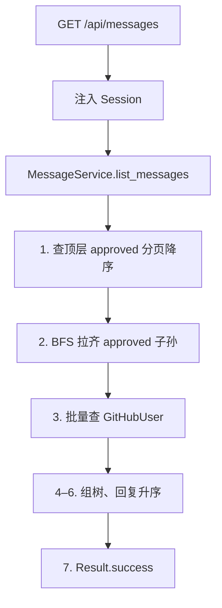
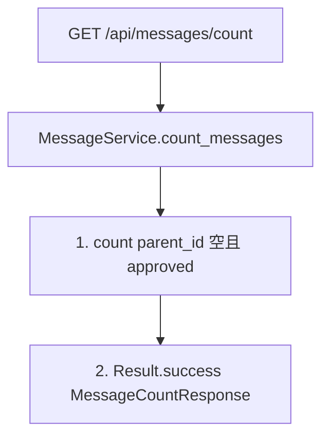
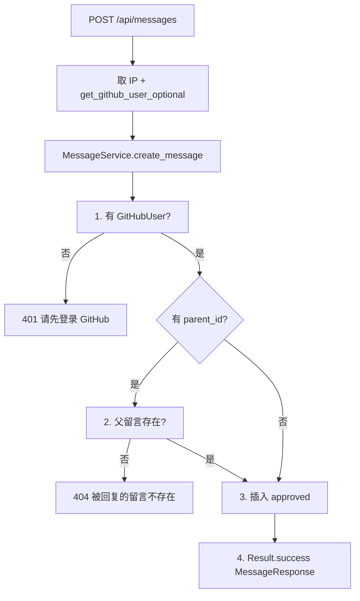
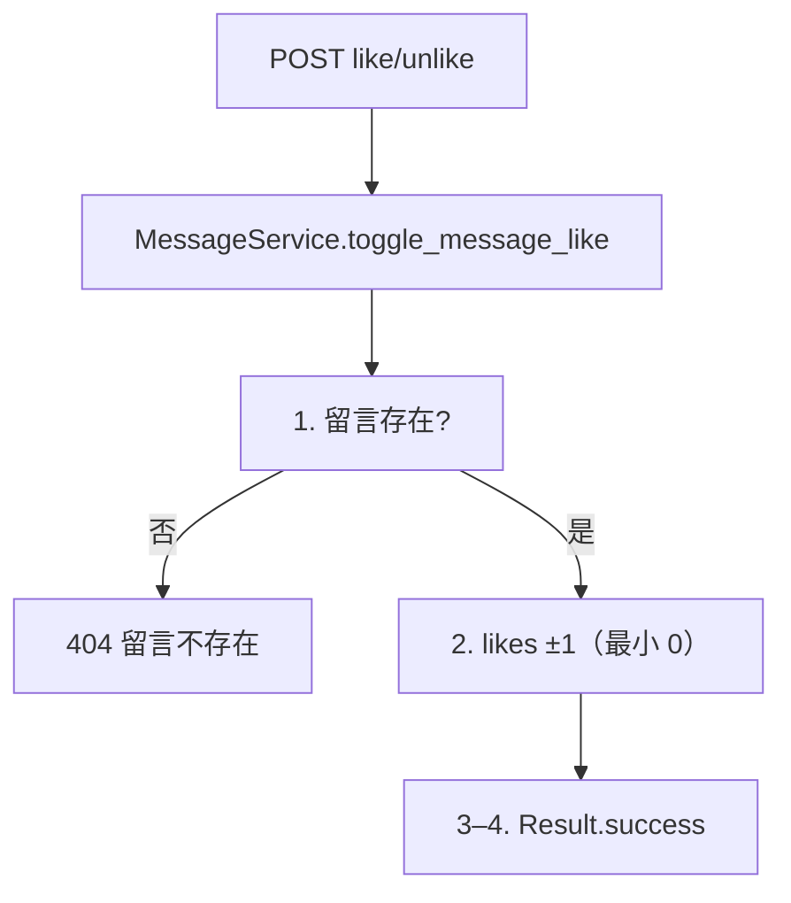
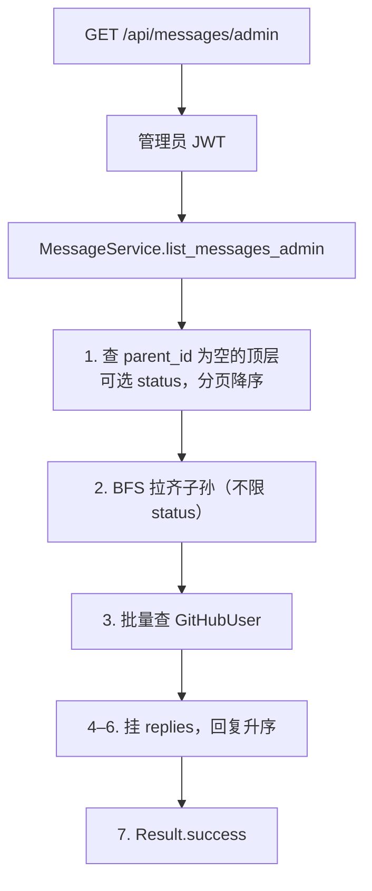
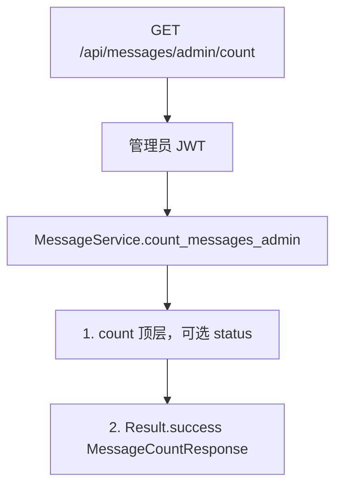
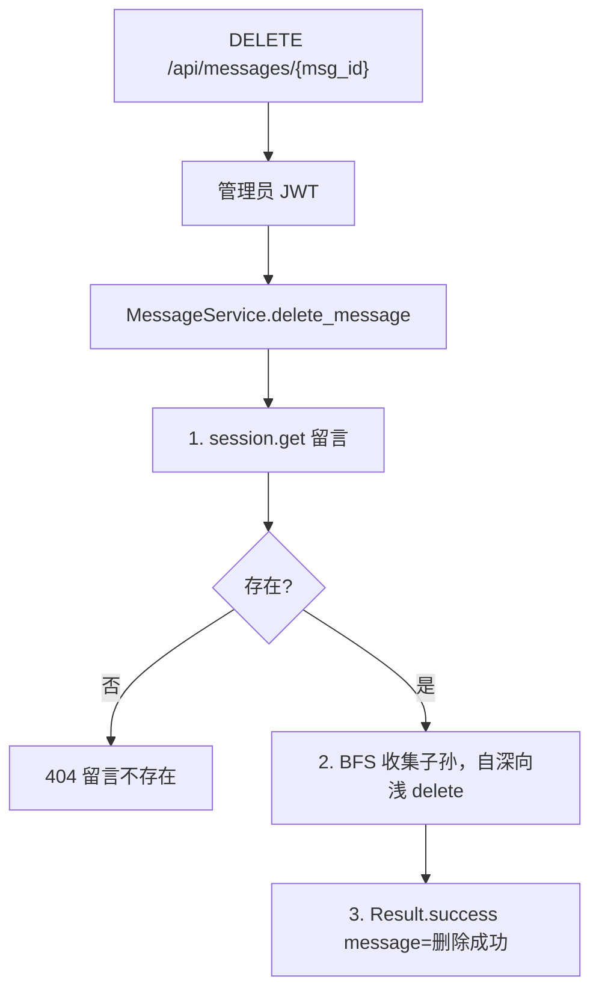

# 06 — 留言板

> 对照源码：`app/api/MessagesRouter.py`、`app/service/MessageService.py`、`app/schemas/MessageSchemas.py`、`app/models/Message.py`
>
> Swagger tag：`留言板`　前缀：`/api/messages`

全站留言，不挂文章。结构与评论类似：`parent_id` 楼中楼。含公开端与管理端。

## 1. 模块说明

| 项 | 内容 |
|----|------|
| 表 | `message` |
| 鉴权 | 列表 / count / 点赞公开；`POST /` 需 GitHub JWT；`/admin*`、改状态、删除需管理员 JWT |
| 响应 | 统一 `{code, message, data}`，成功 `code=200` |
| 出参 | `MessageResponse` **含** `ip`、`github_user_id`（前台可不展示 ip） |
| 状态 | 发表默认 `approved`；前台只返回 `approved`；管理端可筛 / 改 `pending` / `approved` / `rejected` |
| 分页 | 只分页顶层；`page=1`，`size=20`（最大 100）；顶层降序，回复升序 |

相关文件：

| 角色 | 文件 |
|------|------|
| 路由 | `app/api/MessagesRouter.py` |
| 业务 | `app/service/MessageService.py` |
| DTO | `app/schemas/MessageSchemas.py` |
| 表 | `app/models/Message.py` |

**路由顺序**：`/count`、`/admin`、`/admin/count` 写在 `/{msg_id}/...` 之前。

---

## 2. 前后端交接规范

### 2.1 接口一览

| 方法 | 路径 | 鉴权 | 说明 |
|------|------|------|------|
| GET | `/api/messages` | 无 | 已审核顶层 + replies，分页 |
| GET | `/api/messages/count` | 无 | 已审核顶层数量 |
| POST | `/api/messages` | GitHub JWT | 留言 / 回复 |
| POST | `/api/messages/{msg_id}/like` | 无 | likes +1 |
| POST | `/api/messages/{msg_id}/unlike` | 无 | likes -1，最小 0 |
| GET | `/api/messages/admin` | 管理员 | 顶层分页 + replies（各状态） |
| GET | `/api/messages/admin/count` | 管理员 | 顶层数量，可选 status |
| PUT | `/api/messages/{msg_id}/status` | 管理员 | 改审核状态 |
| DELETE | `/api/messages/{msg_id}` | 管理员 | 删自身及子孙 |

### 2.2 GET `/api/messages`

**Query**

| 字段 | 类型 | 必填 | 默认 | 说明 |
|------|------|------|------|------|
| page | int | 否 | 1 | `ge=1` |
| size | int | 否 | 20 | `1..100` |

**data[]（MessageResponse）**

| 字段 | 类型 | 说明 |
|------|------|------|
| id | int | 主键 |
| github_user_id | int \| null | 留言者本地主键 |
| parent_id | int \| null | 父留言；顶层 `null` |
| content | string | 正文 |
| ip | string | 留言者 IP，可空串 |
| status | string | 本接口恒为 `approved` |
| likes | int | 点赞数 |
| created_at | datetime | ISO 8601 |
| github_user | object \| null | `{id, login, avatar, bio}` |
| replies | MessageResponse[] | 已审核子回复 |

`size=1` 时 `data` 最多 1 条顶层，该条的 `replies` 仍完整。

### 2.3 GET `/api/messages/count`

无 query。成功：

```json
{ "code": 200, "message": "success", "data": { "count": 3 } }
```

### 2.4 POST `/api/messages`

须 GitHub 访客 Token。

**请求**

| 字段 | 类型 | 必填 | 说明 |
|------|------|------|------|
| content | string | 是 | 正文 |
| parent_id | int \| null | 否 | 回复时填；顶层不传或 `null` |

```json
{ "content": "你好", "parent_id": null }
```

**成功** `data` 为新建 `MessageResponse`（`replies` 为 `[]`）。

**失败**

| HTTP / code | message | 何时 |
|-------------|---------|------|
| 401 | 请先登录 GitHub | 未带 / 无效 GitHub JWT |
| 404 | 被回复的留言不存在 | `parent_id` 对不上 |
| 422 | 参数校验失败 | 缺 content 等 |

### 2.5 POST `/api/messages/{msg_id}/like` · `/unlike`

公开。成功返回该条 `MessageResponse`（`replies` 为 `[]`）。不存在 → 404「留言不存在」。

### 2.6 GET `/api/messages/admin`

需管理员 JWT。只分页顶层；可选 `status` 筛顶层；子回复拉全状态。

**Query**

| 字段 | 类型 | 必填 | 默认 | 说明 |
|------|------|------|------|------|
| status | string | 否 | — | `pending` / `approved` / `rejected`；不传=全部顶层 |
| page | int | 否 | 1 | `ge=1` |
| size | int | 否 | 20 | `1..100` |

**成功** `data` 为 `MessageResponse[]`（含 `ip`、嵌套 `replies`）。

**失败**：403 / 401 同全局鉴权。

### 2.7 GET `/api/messages/admin/count`

需管理员 JWT。

**Query**：`status?` 可选；不传统计全部顶层。

```json
{ "code": 200, "message": "success", "data": { "count": 5 } }
```

### 2.8 PUT `/api/messages/{msg_id}/status`

需管理员 JWT。

**请求**

| 字段 | 类型 | 必填 | 说明 |
|------|------|------|------|
| status | string | 是 | `pending` / `approved` / `rejected` |

```json
{ "status": "rejected" }
```

**成功** `data` 为该条 `MessageResponse`（含 `ip`，`replies` 为 `[]`）。

**失败**

| HTTP / code | message | 何时 |
|-------------|---------|------|
| 400 | 状态不合法 | status 不是三者之一 |
| 404 | 留言不存在 | id 对不上 |
| 403 / 401 | 同全局鉴权 | 未带或无效管理员 Token |
| 422 | 参数校验失败 | 缺 status |

### 2.9 DELETE `/api/messages/{msg_id}`

需管理员 JWT。先删全部子孙再删自身。

**成功**

```json
{ "code": 200, "message": "删除成功", "data": null }
```

**失败**

| HTTP / code | message | 何时 |
|-------------|---------|------|
| 404 | 留言不存在 | id 对不上 |
| 403 / 401 | 同全局鉴权 | 未带或无效管理员 Token |

---

## 3. 后端接口执行流程

### 3.1 GET `/api/messages`



### 3.2 GET `/api/messages/count`



### 3.3 POST `/api/messages`



### 3.4 POST `.../like` · `.../unlike`



### 3.5 GET `/api/messages/admin`



### 3.6 GET `/api/messages/admin/count`



### 3.7 PUT `/api/messages/{msg_id}/status`

```mermaid
flowchart TD
    A["PUT .../status"] --> B["管理员 JWT + UpdateMessageStatusRequest"]
    B --> C["MessageService.update_message_status"]
    C --> D["1. status 在允许集合内?"]
    D -->|否| E["400 状态不合法"]
    D -->|是| F["2. session.get 留言"]
    F --> G{"存在?"}
    G -->|否| H["404 留言不存在"]
    G -->|是| I["3. 写 status，commit"]
    I --> J["4–5. Result.success MessageResponse"]
```



### 3.8 DELETE `/api/messages/{msg_id}`


