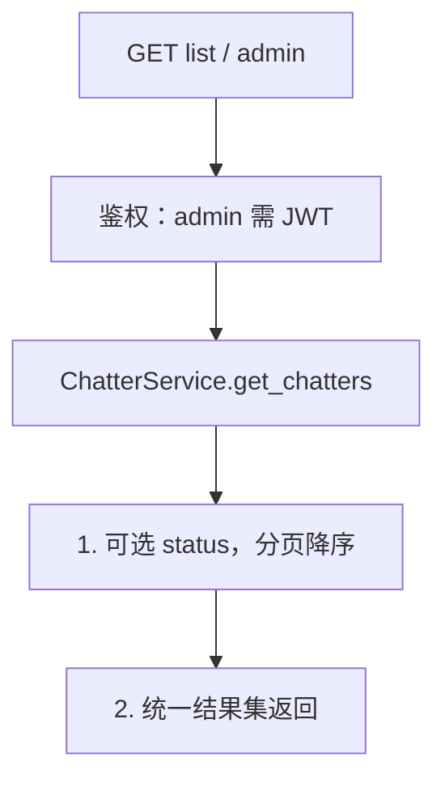
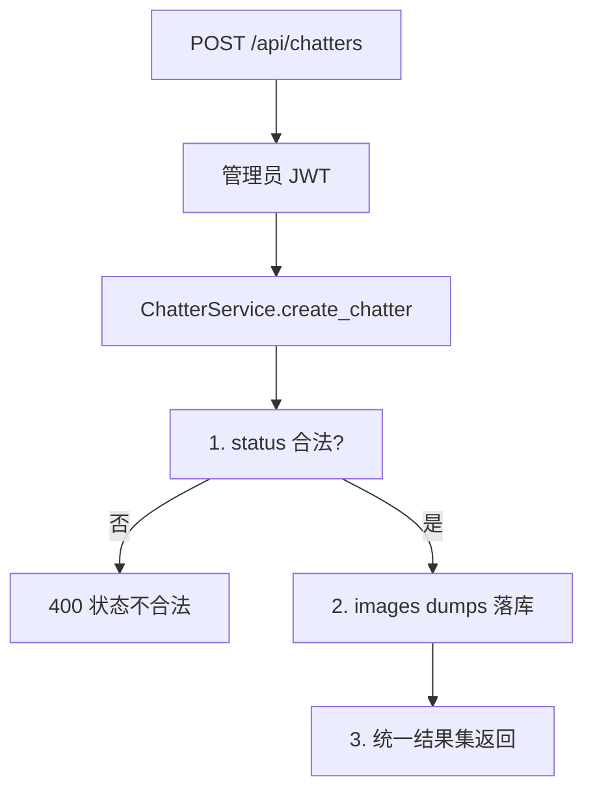
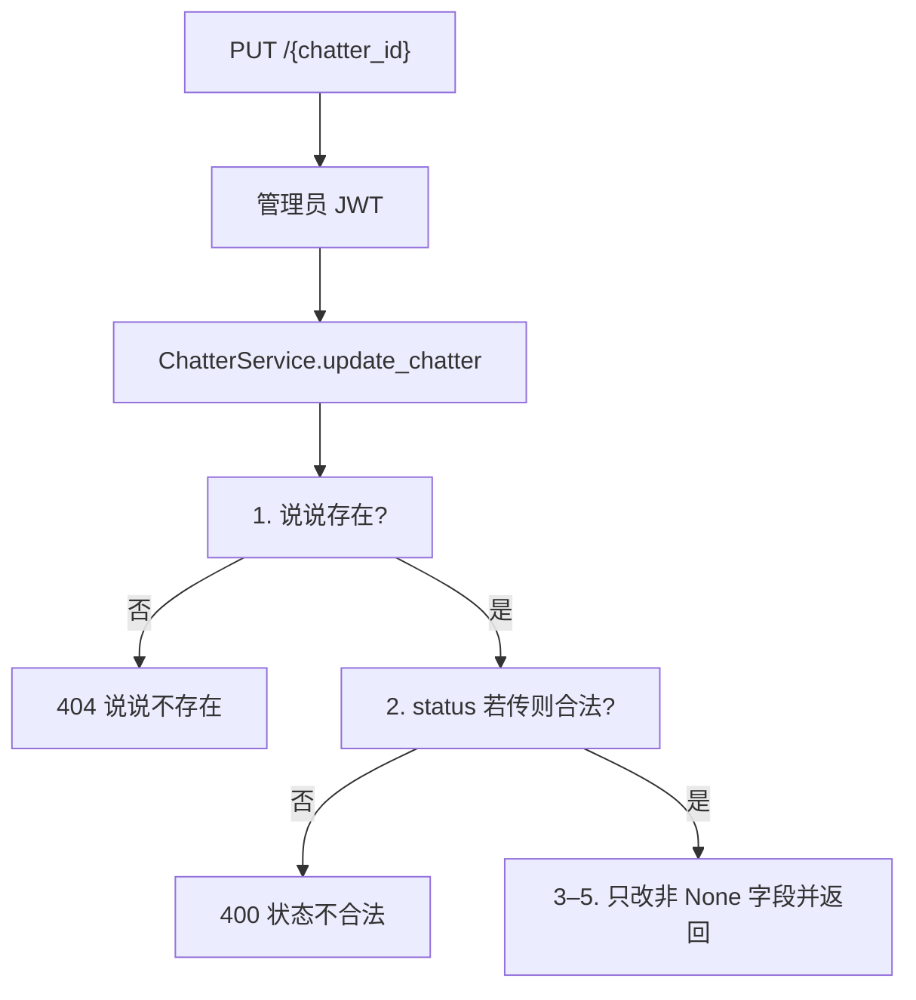
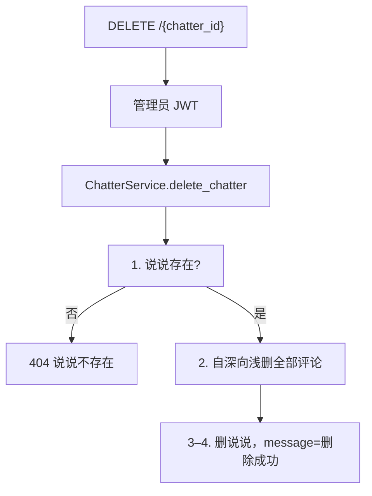

# 07 — 说说

> 对照源码：`app/api/ChatterRouter.py`、`app/service/ChatterService.py`、`app/schemas/ChatterSchemas.py`、`app/models/Chatter.py`、`app/models/ChatterComment.py`
>
> Swagger tag：`说说模块`　前缀：`/api/chatters`

管理员发布的短动态；访客可评论 / 点赞。含公开端与管理端。

## 1. 模块说明

| 项 | 内容 |
|----|------|
| 表 | `chatter`；评论表 `chatter_comment`（类名 `ChatterComment`，须显式 `__tablename__`） |
| 鉴权 | 读 / 点赞公开；`POST /comments` 须 GitHub JWT；`/admin*`、创建 / 更新 / 删除说说、审核 / 删除评论须管理员 JWT |
| 列表 | 前台只 `published`；管理端可按 `status` 筛（含草稿） |
| 详情 | 按主键取，**含草稿**；不存在 404 `说说不存在` |
| 评论树 | 前台只 `approved`，不含 `ip`；管理端含 `ip` 与各状态 replies |
| 发表评论 | 默认 `approved`；成功后 `comments_count +1`；删除评论按条数回减（最小 0） |
| 点赞 | 说说点赞 `data` 为 `{likes}`；评论点赞 `data` 为整条评论（`replies` 为空） |
| images | 库内 TEXT JSON 字符串；请求 / 响应为 `string[]` |

**路由顺序（必须）**：

```
GET    /api/chatters
GET    /api/chatters/count
GET    /api/chatters/admin
POST   /api/chatters
GET    /api/chatters/comments/admin
PUT    /api/chatters/comments/{comment_id}/status
DELETE /api/chatters/comments/{comment_id}
POST   /api/chatters/comments
POST   /api/chatters/comments/{comment_id}/like
POST   /api/chatters/comments/{comment_id}/unlike
GET    /api/chatters/{chatter_id}/comments
GET    /api/chatters/{chatter_id}
POST   /api/chatters/{chatter_id}/like
POST   /api/chatters/{chatter_id}/unlike
PUT    /api/chatters/{chatter_id}
DELETE /api/chatters/{chatter_id}
```

相关文件：

| 角色 | 文件 |
|------|------|
| 路由 | `app/api/ChatterRouter.py` |
| 业务 | `app/service/ChatterService.py` |
| DTO | `app/schemas/ChatterSchemas.py` |
| 表 | `app/models/Chatter.py`、`app/models/ChatterComment.py` |

说说状态：`draft` / `published`。评论状态：`pending` / `approved` / `rejected`。JSON 为 snake_case。

---

## 2. 前后端交接规范

### 2.1 接口一览

| 方法 | 路径 | 鉴权 | 说明 |
|------|------|------|------|
| GET | `/api/chatters` | 无 | 已发布说说分页列表 |
| GET | `/api/chatters/count` | 无 | 按状态计数，默认 published |
| GET | `/api/chatters/admin` | 管理员 JWT | 可按 status 筛，含草稿 |
| POST | `/api/chatters` | 管理员 JWT | 发表说说 |
| PUT | `/api/chatters/{chatter_id}` | 管理员 JWT | 更新，只改传入字段 |
| DELETE | `/api/chatters/{chatter_id}` | 管理员 JWT | 删说说及下属评论 |
| GET | `/api/chatters/{chatter_id}` | 无 | 按 id 详情，含草稿 |
| GET | `/api/chatters/{chatter_id}/comments` | 无 | 该说说已审核评论树 |
| POST | `/api/chatters/comments` | GitHub JWT | 发表 / 回复 |
| GET | `/api/chatters/comments/admin` | 管理员 JWT | 顶层分页，含 IP |
| PUT | `/api/chatters/comments/{comment_id}/status` | 管理员 JWT | 改审核状态 |
| DELETE | `/api/chatters/comments/{comment_id}` | 管理员 JWT | 删评论（含子孙） |
| POST | `/api/chatters/{chatter_id}/like` | 无 | 说说点赞 |
| POST | `/api/chatters/{chatter_id}/unlike` | 无 | 说说取消点赞 |
| POST | `/api/chatters/comments/{comment_id}/like` | 无 | 评论点赞 |
| POST | `/api/chatters/comments/{comment_id}/unlike` | 无 | 评论取消点赞 |

### 2.2 GET `/api/chatters`

公开。固定筛 `published`。Query：`page=1`，`size=20`（最大 200）。

**data[]（ChatterResponse）**：`id, content, images[], mood, likes, comments_count, status, created_at, updated_at`。`images` 为数组不是字符串。

### 2.3 GET `/api/chatters/count`

公开。Query `status` 默认 `"published"`；传空串则统计全部。成功 `data: { "count": N }`。

### 2.4 GET `/api/chatters/admin`

需管理员 JWT。Query：`status?`（不传=全部）、`page=1`、`size=20`（最大 200）。`data` 为 `ChatterResponse[]`。

### 2.5 POST `/api/chatters`

需管理员 JWT。

| 字段 | 类型 | 必填 | 默认 | 说明 |
|------|------|------|------|------|
| content | string | 是 | | Markdown |
| images | string[] | 否 | `[]` | |
| mood | string | 否 | `""` | |
| status | string | 否 | `draft` | draft / published |

非法 status → 400 `状态不合法`。成功 `data` 为 `ChatterResponse`。

### 2.6 PUT `/api/chatters/{chatter_id}`

需管理员 JWT。字段全部可选；`images` 传 `[]` 表示清空。不存在 → 404 `说说不存在`；非法 status → 400 `状态不合法`。

### 2.7 DELETE `/api/chatters/{chatter_id}`

需管理员 JWT。成功 `data: null`，`message` 为「删除成功」。不存在 → 404 `说说不存在`。

### 2.8 GET `/api/chatters/{chatter_id}`

公开。含草稿。不存在 → 404 `说说不存在`。

### 2.9 GET `/api/chatters/{chatter_id}/comments`

公开。只 `approved`；顶层降序，回复升序；无评论或说说不存在时 `data` 为 `[]`。前台 **不含** `ip`。

**data[]（ChatterCommentResponse）**：`id, chatter_id, parent_id, content, likes, status, created_at, github_user, replies`。

### 2.10 POST `/api/chatters/comments`

须 GitHub JWT。Body：`chatter_id`、`parent_id?`、`content`。成功后 `comments_count +1`。

| HTTP / code | message | 何时 |
|-------------|---------|------|
| 401 | 请先登录 GitHub | 未带 / 无效 GitHub JWT |
| 404 | 说说不存在 | |
| 404 | 被回复的评论不存在 | |

### 2.11 GET `/api/chatters/comments/admin`

需管理员 JWT。只分页顶层；Query：`status?`、`page=1`、`size=20`（最大 100）。`data` 为 `ChatterCommentAdminResponse[]`（含 `ip`、各状态 `replies`）。

### 2.12 PUT `/api/chatters/comments/{comment_id}/status`

需管理员 JWT。Body `{ "status": "approved" }`。允许 `pending` / `approved` / `rejected`。非法 → 400 `状态不合法`；不存在 → 404 `评论不存在`。

### 2.13 DELETE `/api/chatters/comments/{comment_id}`

需管理员 JWT。先删子孙再删自身，并按删除条数回减 `comments_count`（最小 0）。成功 `message` 为「删除成功」。

### 2.14 POST `.../like` · `.../unlike`

- 说说：`data` 为 `{ "likes": N }`；404 `说说不存在`
- 评论：`data` 为 `ChatterCommentResponse`（`replies` 为空）；404 `评论不存在`

---

## 3. 后端接口执行流程

### 3.1 GET `/api/chatters` · `/admin`



前台固定 `status=published`；管理端 `status` 可选。

### 3.2 POST `/api/chatters`



### 3.3 PUT `/api/chatters/{chatter_id}`



### 3.4 DELETE `/api/chatters/{chatter_id}`



### 3.5 GET `/{chatter_id}/comments` · POST `/comments`

前台树与发表步骤同文章评论：查 approved → 挂树；发表须 GitHub，校验说说 / 父评论，`comments_count +1`。

### 3.6 GET `/comments/admin` · PUT status · DELETE comment

与评论模块管理端同构：顶层分页 + BFS 子孙；改 status；BFS 删子孙并回减 `comments_count`。

### 3.7 POST like / unlike

说说返回 `{likes}`；评论返回整条 `ChatterCommentResponse`。不存在对应 404 文案。
