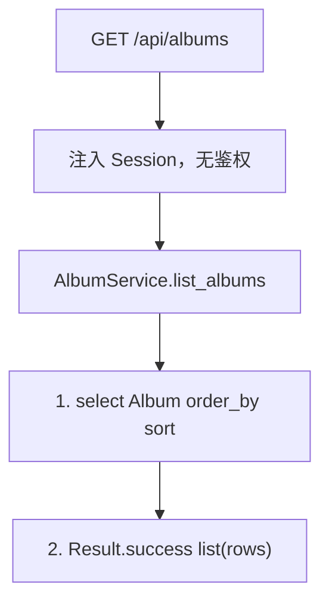
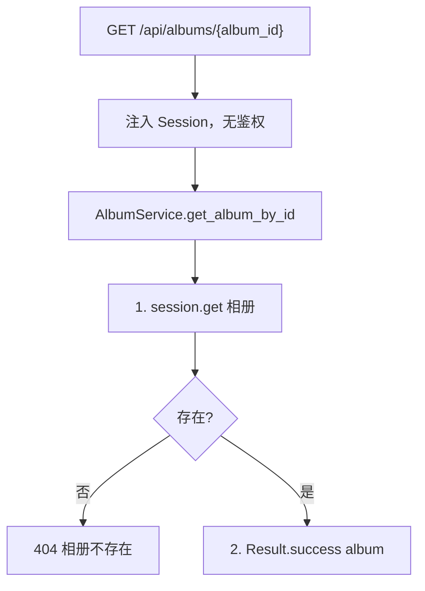
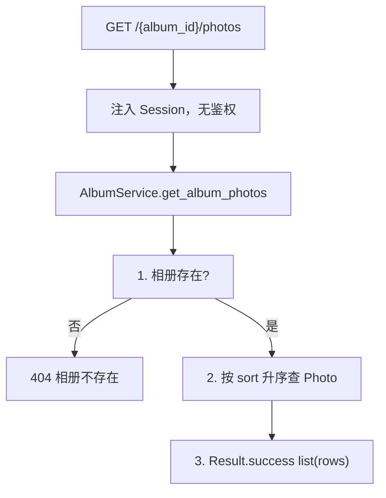
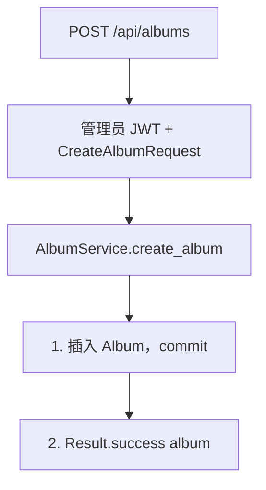
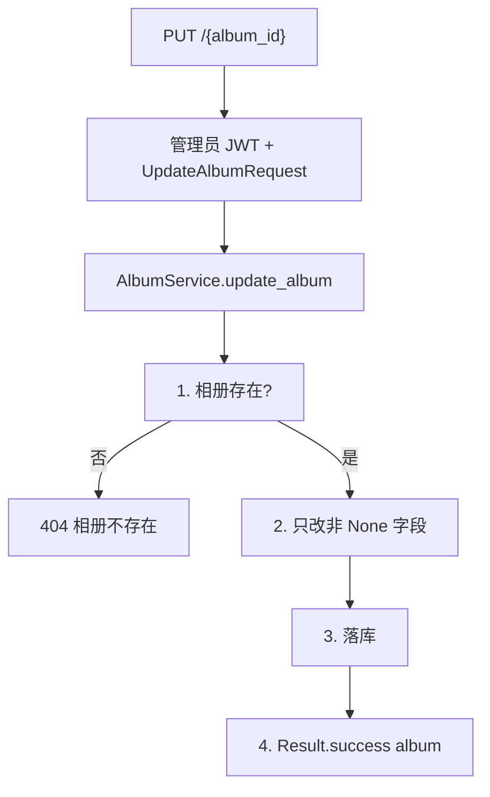
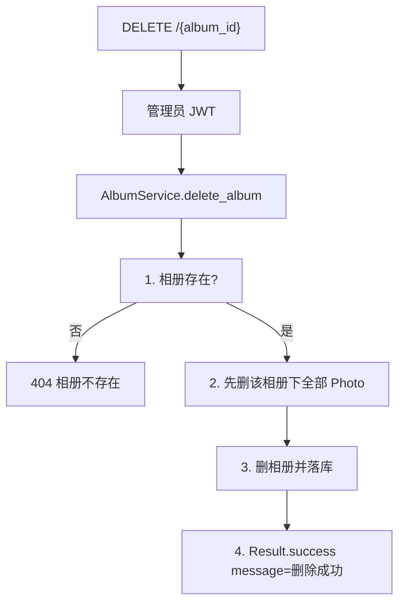
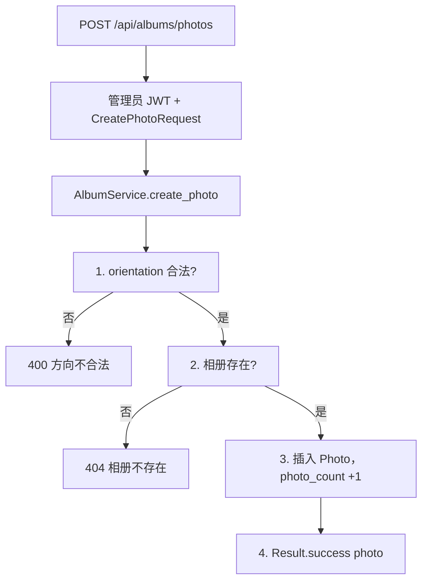
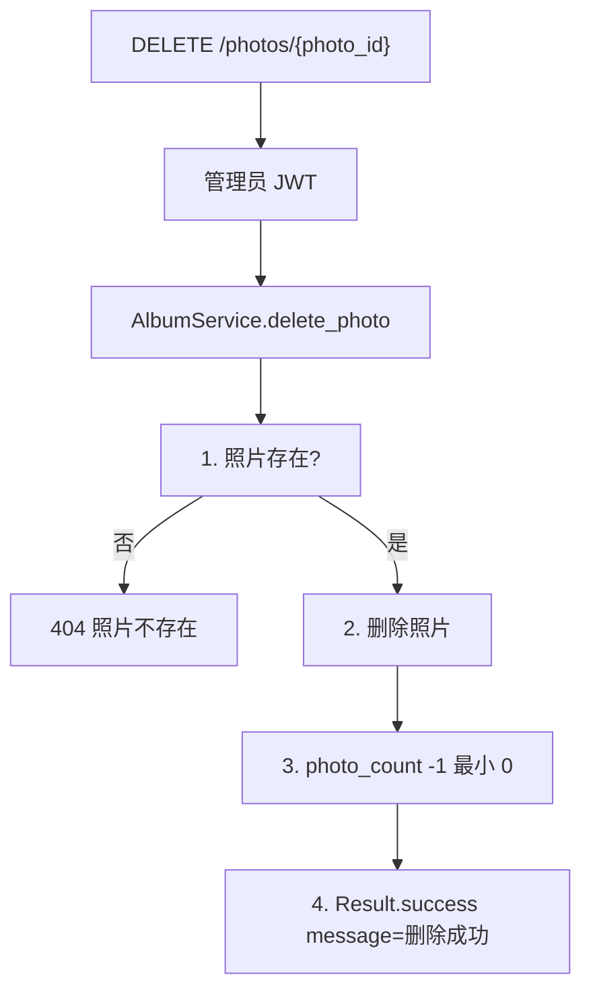
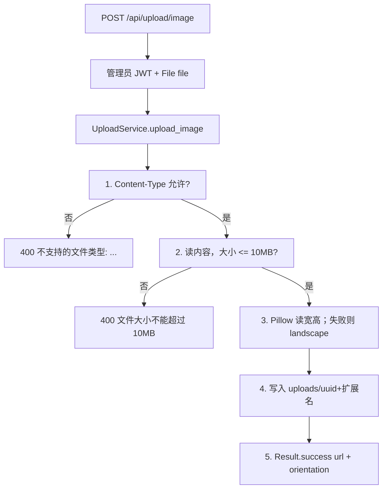

# 08 — 相册与图片上传

> 对照源码：`app/api/AlbumRouter.py`、`app/api/UploadRouter.py`、`app/service/AlbumService.py`、`app/service/UploadService.py`、`app/schemas/AlbumSchemas.py`、`app/schemas/UploadSchemas.py`、`app/models/Album.py`、`app/models/Photo.py`
>
> Swagger tag：`相册模块`、`上传`　前缀：`/api/albums`、`/api/upload`

相册 CRUD 与照片增删；图片先走独立上传接口拿到 url，再写入照片。学习阶段文件落在本地 `uploads/`。

## 1. 模块说明

| 项 | 内容 |
|----|------|
| 表 | `album`；照片表 `photo`（`album_id` 指向相册） |
| 鉴权 | 读公开；写相册 / 照片、上传须管理员 JWT |
| 列表 | 相册、照片均按 `sort` 升序 |
| 计数 | 加 / 删照片后按 `photo` 表实际条数回写 `photo_count`；删相册先删其下全部照片 |
| 首页预览 | 前台 `PhotoWallPreview` 优先相册标题 `1`（桌面）/`2`（手机），没有则取有照片的相册 |
| 封面 / url | 都是字符串。相册接口不接收文件；图片走 `POST /api/upload/image` |
| 上传 | multipart 字段名 **`file`**（不是 JSON）；本地 url 为相对路径 `/uploads/{filename}` |
| 访问 | 前台 Kirameku `rewrites`、管理端 Vite `proxy` 把 `/uploads` 转到后端；`next/image` 另放行 `localhost:8000` / `127.0.0.1:8000` 兜底 |
| orientation | `landscape`（宽 >= 高）或 `portrait`；Pillow 读失败默认 `landscape` |

**路由顺序（必须）**：`POST /photos`、`DELETE /photos/{photo_id}`、`GET /{album_id}/photos` 写在裸 `/{album_id}` 之前。`album_id` 是 int 时 `photos` 不会误匹配，仍按静态路径先注册。

相关文件：

| 角色 | 文件 |
|------|------|
| 路由 | `app/api/AlbumRouter.py`、`app/api/UploadRouter.py` |
| 业务 | `app/service/AlbumService.py`、`app/service/UploadService.py` |
| DTO | `app/schemas/AlbumSchemas.py`、`app/schemas/UploadSchemas.py` |
| 表 | `app/models/Album.py`、`app/models/Photo.py` |
| 落盘目录 | `uploads/`（`Config.UPLOADS_DIR`，`main.py` 挂载 `/uploads`） |

JSON 为 snake_case。上传成功 `data` 为 `{url, orientation}`，仍走统一信封 `{code, message, data}`。

---

## 2. 前后端交接规范

### 2.1 接口一览

| 方法 | 路径 | 鉴权 | 说明 |
|------|------|------|------|
| GET | `/api/albums` | 无 | 全部相册，按 sort 升序 |
| GET | `/api/albums/{album_id}` | 无 | 相册详情 |
| GET | `/api/albums/{album_id}/photos` | 无 | 该相册照片，按 sort 升序 |
| POST | `/api/albums` | 管理员 JWT | 创建相册 |
| PUT | `/api/albums/{album_id}` | 管理员 JWT | 更新，只改传入字段 |
| DELETE | `/api/albums/{album_id}` | 管理员 JWT | 删相册及下属照片 |
| POST | `/api/albums/photos` | 管理员 JWT | 添加一张照片（URL 已上传） |
| DELETE | `/api/albums/photos/{photo_id}` | 管理员 JWT | 删照片并回减 photo_count |
| POST | `/api/upload/image` | 管理员 JWT | multipart 上传图片 |

路径参数 `album_id` / `photo_id` 是整数主键。未带 Token 调写接口 → **403**；Token 无效 → **401** `无效的令牌`。

### 2.2 GET `/api/albums`

公开。无 query。成功 `data` 为数组（可空 `[]`）。

**data[] 字段（AlbumResponse）**

| 字段 | 类型 | 说明 |
|------|------|------|
| id | int | 主键 |
| title | string | 标题 |
| description | string | 描述，空则 `""` |
| cover | string | 封面 URL，空则 `""` |
| photo_count | int | 照片数（照片增删维护） |
| sort | int | 越小越靠前 |
| created_at | datetime | ISO 8601 |
| updated_at | datetime | ISO 8601 |

```json
{
  "code": 200,
  "message": "success",
  "data": [
    {
      "id": 1,
      "title": "2026 春游",
      "description": "",
      "cover": "/uploads/a1b2c3d4e5f6.jpg",
      "photo_count": 1,
      "sort": 0,
      "created_at": "2026-09-02T21:00:00",
      "updated_at": "2026-09-02T21:00:00"
    }
  ]
}
```

### 2.3 GET `/api/albums/{album_id}`

公开。含 `photo_count`。不存在 → 404 `相册不存在`。

成功 `data` 为单个 `AlbumResponse`（字段同列表单项）。

**失败**

| HTTP / code | message | 何时 |
|-------------|---------|------|
| 404 | 相册不存在 | id 对不上 |
| 422 | 参数校验失败 | `album_id` 不是整数 |

### 2.4 GET `/api/albums/{album_id}/photos`

公开。按 `sort` 升序。相册不存在 → 404 `相册不存在`；无照片时 `data` 为 `[]`。

**data[] 字段（PhotoResponse）**

| 字段 | 类型 | 说明 |
|------|------|------|
| id | int | 主键 |
| album_id | int | 所属相册 |
| url | string | 图片地址 |
| caption | string | 说明，空则 `""` |
| orientation | string | `landscape` / `portrait` |
| sort | int | 越小越靠前 |
| created_at | datetime | ISO 8601 |

```json
{
  "code": 200,
  "message": "success",
  "data": [
    {
      "id": 1,
      "album_id": 1,
      "url": "/uploads/a1b2c3d4e5f6.jpg",
      "caption": "",
      "orientation": "landscape",
      "sort": 0,
      "created_at": "2026-09-02T21:00:00"
    }
  ]
}
```

**失败**

| HTTP / code | message | 何时 |
|-------------|---------|------|
| 404 | 相册不存在 | `album_id` 对不上 |
| 422 | 参数校验失败 | `album_id` 不是整数 |

### 2.5 POST `/api/albums`

需管理员 JWT。

**请求** `application/json`

| 字段 | 类型 | 必填 | 默认 | 说明 |
|------|------|------|------|------|
| title | string | 是 | | 标题 |
| description | string | 否 | `""` | |
| cover | string | 否 | `""` | 封面 URL，通常先上传再填 |
| sort | int | 否 | `0` | 越小越靠前 |

```json
{ "title": "2026 春游", "description": "", "cover": "", "sort": 0 }
```

**成功** HTTP 200，`data` 为刚创建的相册（`photo_count` 为 0）。

**失败**

| HTTP / code | message | 何时 |
|-------------|---------|------|
| 403 / 401 | 见全局约定 | 未登录 / Token 无效 |
| 422 | 参数校验失败 | 缺 title 等 |

### 2.6 PUT `/api/albums/{album_id}`

需管理员 JWT。字段全部可选；`cover` 传 `""` 表示清空。不传则不改。

| 字段 | 类型 | 说明 |
|------|------|------|
| title | string \| null | 不传不改 |
| description | string \| null | 不传不改 |
| cover | string \| null | 不传不改；传 `""` 清空 |
| sort | int \| null | 不传不改 |

```json
{ "cover": "/uploads/a1b2c3d4e5f6.jpg" }
```

**成功** HTTP 200，`data` 为更新后的完整相册。

**失败**

| HTTP / code | message | 何时 |
|-------------|---------|------|
| 404 | 相册不存在 | id 对不上 |
| 403 / 401 | 见全局约定 | 未登录 / Token 无效 |
| 422 | 参数校验失败 | 路径或类型不对 |

### 2.7 DELETE `/api/albums/{album_id}`

需管理员 JWT。先删该相册下全部照片再删相册。不删磁盘上的上传文件。

**成功**

```json
{ "code": 200, "message": "删除成功", "data": null }
```

**失败**

| HTTP / code | message | 何时 |
|-------------|---------|------|
| 404 | 相册不存在 | id 对不上 |
| 403 / 401 | 见全局约定 | 未登录 / Token 无效 |

### 2.8 POST `/api/albums/photos`

需管理员 JWT。先调上传拿到 `url`（及建议的 `orientation`），再调本接口。成功后所属相册 `photo_count +1`。

**请求** `application/json`

| 字段 | 类型 | 必填 | 默认 | 说明 |
|------|------|------|------|------|
| album_id | int | 是 | | 所属相册 |
| url | string | 是 | | 上传接口返回的 url |
| caption | string | 否 | `""` | |
| orientation | string | 否 | `"landscape"` | 仅 `landscape` / `portrait` |
| sort | int | 否 | `0` | 越小越靠前 |

```json
{
  "album_id": 1,
  "url": "/uploads/a1b2c3d4e5f6.jpg",
  "caption": "",
  "orientation": "landscape",
  "sort": 0
}
```

**成功** HTTP 200，`data` 为新建的 `PhotoResponse`。

**失败**

| HTTP / code | message | 何时 |
|-------------|---------|------|
| 400 | 方向不合法 | orientation 不是二者之一 |
| 404 | 相册不存在 | `album_id` 对不上 |
| 403 / 401 | 见全局约定 | 未登录 / Token 无效 |
| 422 | 参数校验失败 | 缺 album_id / url |

### 2.9 DELETE `/api/albums/photos/{photo_id}`

需管理员 JWT。删记录并回减所属相册 `photo_count`（最小 0）。不删磁盘文件。

**成功**

```json
{ "code": 200, "message": "删除成功", "data": null }
```

**失败**

| HTTP / code | message | 何时 |
|-------------|---------|------|
| 404 | 照片不存在 | id 对不上 |
| 403 / 401 | 见全局约定 | 未登录 / Token 无效 |
| 422 | 参数校验失败 | `photo_id` 不是整数 |

### 2.10 POST `/api/upload/image`

需管理员 JWT。Content-Type：`multipart/form-data`，字段名 **`file`**。Swagger 应出现文件选择框，不要当 JSON Body。

允许类型：`image/jpeg`、`image/png`、`image/webp`、`image/gif`、`image/svg+xml`。最大 **10MB**。

文件名：`uuid.hex + 原扩展名`（扩展名不合法时按 Content-Type 补）。svg 用 Pillow 读尺寸常失败，走默认 `landscape`。

**成功**

```json
{
  "code": 200,
  "message": "success",
  "data": {
    "url": "/uploads/a1b2c3d4e5f6.webp",
    "orientation": "landscape"
  }
}
```

浏览器经前台/管理端代理访问 `data.url`；也可直接打开 `http://localhost:8000` + `data.url`。

**失败**

| HTTP / code | message | 何时 |
|-------------|---------|------|
| 400 | 不支持的文件类型: {content_type} | 类型不在允许列表（如 `.txt` → `text/plain`） |
| 400 | 文件大小不能超过 10MB | 超过 10MB |
| 403 / 401 | 见全局约定 | 未带 Token / Token 无效 |
| 422 | 参数校验失败 | 缺 `file` 字段 |

`{content_type}` 为实际 MIME（空则空串），与 `HTTPException.detail` 一字不差。

---

## 3. 后端接口执行流程

写接口鉴权共用：无 Bearer → 403；非法 Token → 401 `无效的令牌`。`current_user` 只用来卡登录，本模块函数体不读 payload。

### 3.1 GET `/api/albums`



### 3.2 GET `/api/albums/{album_id}`



### 3.3 GET `/api/albums/{album_id}/photos`



### 3.4 POST `/api/albums`



### 3.5 PUT `/api/albums/{album_id}`



### 3.6 DELETE `/api/albums/{album_id}`



### 3.7 POST `/api/albums/photos`



### 3.8 DELETE `/api/albums/photos/{photo_id}`



### 3.9 POST `/api/upload/image`


