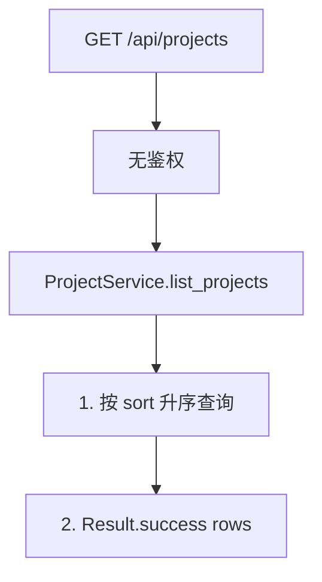
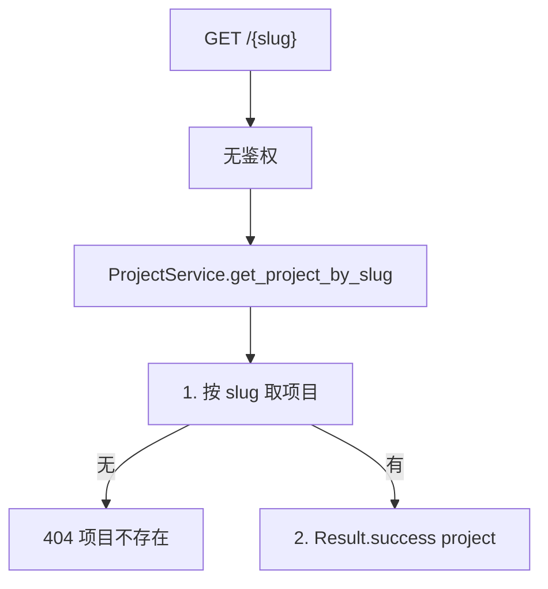
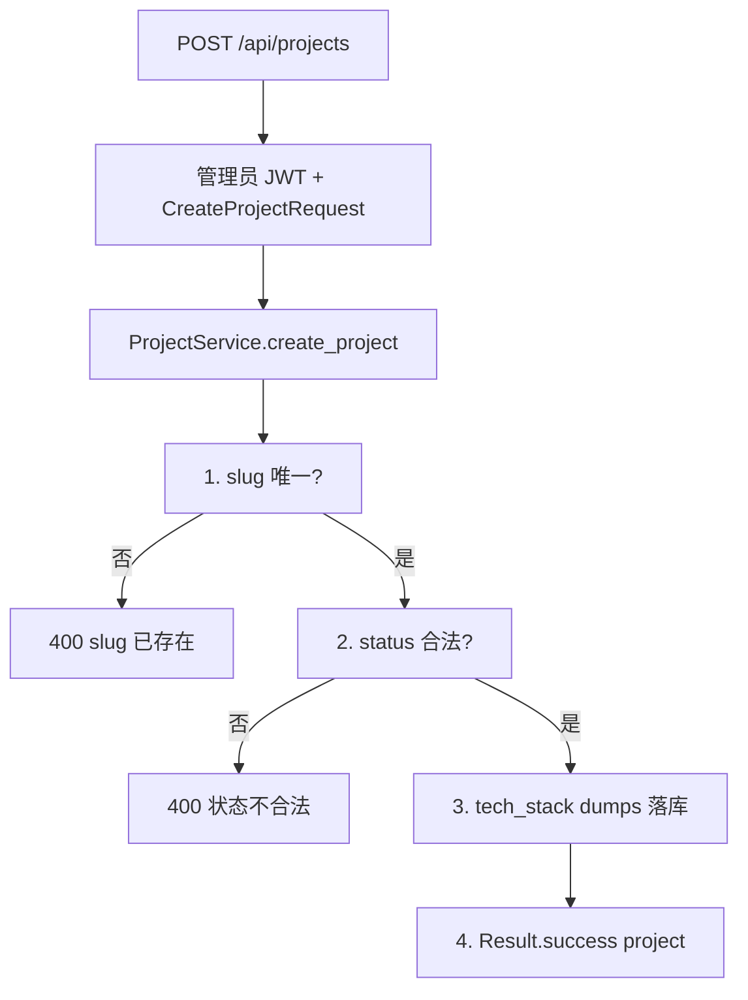
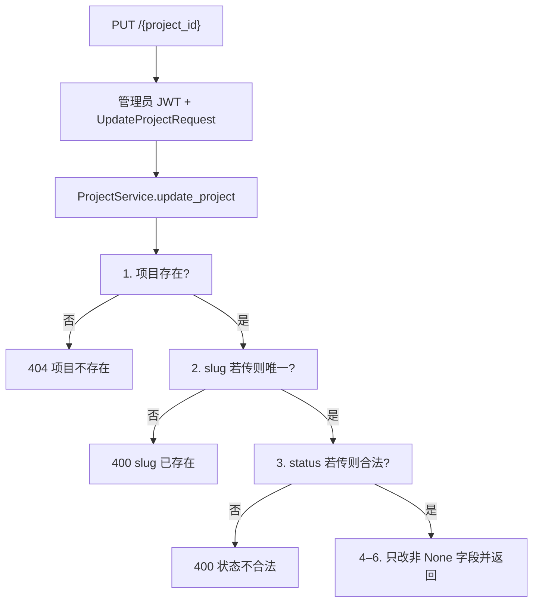
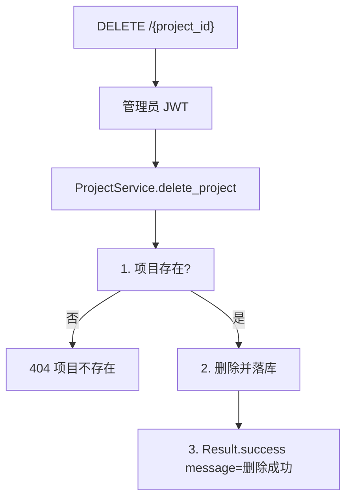
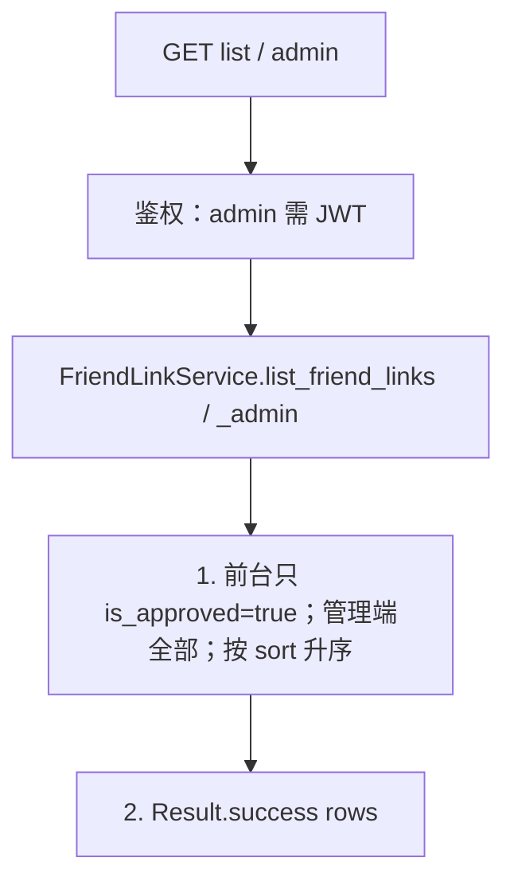
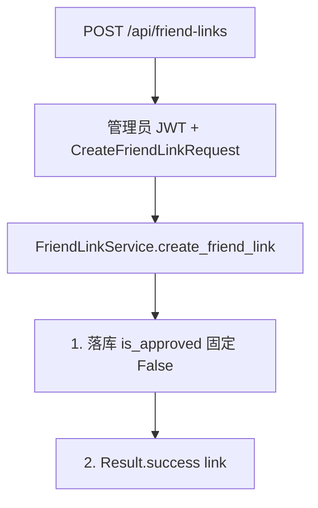
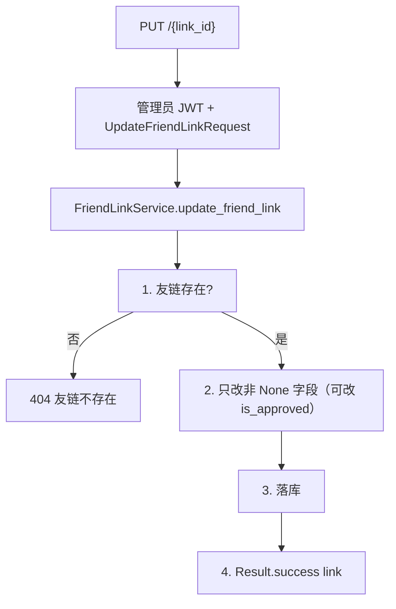
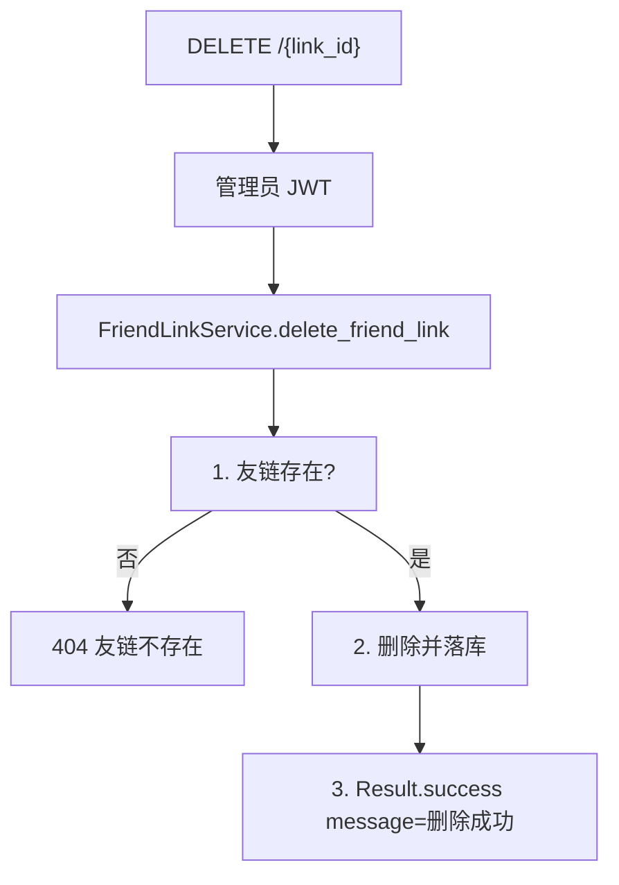

# 09 — 项目展示与友链

> 对照源码：`app/api/ProjectRouter.py`、`app/api/FriendLinkRouter.py`、`app/service/ProjectService.py`、`app/service/FriendLinkService.py`、`app/schemas/ProjectSchemas.py`、`app/schemas/FriendLinkSchemas.py`、`app/models/Project.py`、`app/models/FriendLink.py`
>
> Swagger tag：`项目`、`友链`　前缀：`/api/projects`、`/api/friend-links`

前台只读 + 后台 CRUD。项目按 slug 读、按 id 写；友链前台只返回已审核。

## 1. 模块说明

| 项 | 项目 | 友链 |
|----|------|------|
| 表 | `project` | `friend_link`（类名 `FriendLink`，须显式 `__tablename__`） |
| 鉴权 | 读公开；写须管理员 JWT | 前台列表公开；`/admin`、写须管理员 JWT |
| 列表 | 全部，按 `sort` 升序 | 前台仅 `is_approved=true`；管理端全部。均按 `sort` 升序 |
| 详情 | 按 **slug**；不存在 404 `项目不存在` | 无按 id 的 GET |
| 写入路径 | PUT/DELETE 用 **id**，不是 slug | PUT/DELETE 用 **id** |
| 特例 | `tech_stack` 库内 TEXT JSON，请求/响应为 `string[]` | 新建不含 `is_approved`，默认 `false` |

**路由顺序（必须）**：

```
GET    /api/projects
POST   /api/projects
GET    /api/projects/{slug}          ← 动态 slug 放后面
PUT    /api/projects/{project_id}
DELETE /api/projects/{project_id}

GET    /api/friend-links/admin       ← 静态 /admin 放最前
GET    /api/friend-links
POST   /api/friend-links
PUT    /api/friend-links/{link_id}
DELETE /api/friend-links/{link_id}
```

路径是 **`/api/friend-links`**（连字符），不是 `friend_links`。

相关文件：

| 角色 | 项目 | 友链 |
|------|------|------|
| 路由 | `app/api/ProjectRouter.py` | `app/api/FriendLinkRouter.py` |
| 业务 | `app/service/ProjectService.py` | `app/service/FriendLinkService.py` |
| DTO | `app/schemas/ProjectSchemas.py` | `app/schemas/FriendLinkSchemas.py` |
| 表 | `app/models/Project.py` | `app/models/FriendLink.py` |

项目状态：`developing` / `active` / `archived`。JSON 为 snake_case。

---

## 2. 前后端交接规范

### 2.1 接口一览

| 方法 | 路径 | 鉴权 | 说明 |
|------|------|------|------|
| GET | `/api/projects` | 无 | 全部项目，按 sort 升序 |
| GET | `/api/projects/{slug}` | 无 | 按 slug 详情 |
| POST | `/api/projects` | 管理员 JWT | 创建 |
| PUT | `/api/projects/{project_id}` | 管理员 JWT | 更新，只改传入字段；路径用 id |
| DELETE | `/api/projects/{project_id}` | 管理员 JWT | 删除 |
| GET | `/api/friend-links` | 无 | 仅已审核，按 sort 升序 |
| GET | `/api/friend-links/admin` | 管理员 JWT | 全部（含未审核） |
| POST | `/api/friend-links` | 管理员 JWT | 创建，默认未审核 |
| PUT | `/api/friend-links/{link_id}` | 管理员 JWT | 更新，可改 is_approved |
| DELETE | `/api/friend-links/{link_id}` | 管理员 JWT | 删除 |

路径参数 `project_id` / `link_id` 是整数主键；`slug` 是字符串别名。未带 Token 调写接口 → **403**；Token 无效 → **401** `无效的令牌`。

### 2.2 项目响应字段（ProjectResponse）

列表、详情、创建、更新成功时的 `data`（列表是数组，其余是对象）共用此结构。

| 字段 | 类型 | 说明 |
|------|------|------|
| id | int | 主键 |
| name | string | 名称 |
| slug | string | URL 别名，唯一 |
| description | string | 短描述，空则 `""` |
| long_description | string | 长描述 Markdown，空则 `""` |
| cover_image | string | 封面 URL，空则 `""` |
| tech_stack | string[] | 技术栈；**始终是数组**，不是 JSON 字符串 |
| link_github | string | GitHub 地址，空则 `""` |
| link_gitee | string | Gitee 地址，空则 `""` |
| link_live | string | 线上地址，空则 `""` |
| link_docs | string | 文档地址，空则 `""` |
| status | string | `developing` / `active` / `archived` |
| status_label | string | 展示文案，如「维护中」，空则 `""` |
| is_featured | bool | 是否精选 |
| sort | int | 越小越靠前 |
| created_at | datetime | ISO 8601 |
| updated_at | datetime | ISO 8601 |

### 2.3 GET `/api/projects`

公开。无 query。成功 `data` 为数组（可空 `[]`），按 `sort` 升序。字段见 2.2。

```json
{
  "code": 200,
  "message": "success",
  "data": [
    {
      "id": 1,
      "name": "Kirameku",
      "slug": "kirameku",
      "description": "",
      "long_description": "",
      "cover_image": "",
      "tech_stack": ["Python", "FastAPI"],
      "link_github": "",
      "link_gitee": "",
      "link_live": "",
      "link_docs": "",
      "status": "developing",
      "status_label": "",
      "is_featured": false,
      "sort": 0,
      "created_at": "2026-09-02T22:00:00",
      "updated_at": "2026-09-02T22:00:00"
    }
  ]
}
```

### 2.4 GET `/api/projects/{slug}`

公开。成功 `data` 为单个 `ProjectResponse`。不存在 → 404 `项目不存在`。

**失败**

| HTTP / code | message | 何时 |
|-------------|---------|------|
| 404 | 项目不存在 | slug 对不上 |

### 2.5 POST `/api/projects`

需管理员 JWT。

**请求（CreateProjectRequest）**

| 字段 | 类型 | 必填 | 默认 | 说明 |
|------|------|------|------|------|
| name | string | 是 | | |
| slug | string | 是 | | 全站唯一 |
| description | string | 否 | `""` | |
| long_description | string | 否 | `""` | Markdown |
| cover_image | string | 否 | `""` | |
| tech_stack | string[] | 否 | `[]` | 请求传数组 |
| link_github / link_gitee / link_live / link_docs | string | 否 | `""` | |
| status | string | 否 | `"developing"` | 仅 `developing` / `active` / `archived` |
| status_label | string | 否 | `""` | |
| is_featured | bool | 否 | `false` | |
| sort | int | 否 | `0` | 越小越靠前 |

成功 `data` 为 `ProjectResponse`（`tech_stack` 仍是数组）。

**失败**

| HTTP / code | message | 何时 |
|-------------|---------|------|
| 400 | slug 已存在 | slug 冲突 |
| 400 | 状态不合法 | status 不是三者之一 |
| 403 | Not authenticated | 未带 Token（FastAPI HTTPBearer） |
| 401 | 无效的令牌 | Token 无效/过期 |

### 2.6 PUT `/api/projects/{project_id}`

需管理员 JWT。路径是 **id**，不是 slug。全部字段可选；不传则不改；`tech_stack` 传 `[]` 表示清空。

成功 `data` 为 `ProjectResponse`。

**失败** 另有：404 `项目不存在`；400 `slug 已存在` / `状态不合法`；422 `project_id` 不是整数。

### 2.7 DELETE `/api/projects/{project_id}`

需管理员 JWT。成功：

```json
{ "code": 200, "message": "删除成功", "data": null }
```

不存在 → 404 `项目不存在`。

### 2.8 友链响应字段（FriendLinkResponse）

| 字段 | 类型 | 说明 |
|------|------|------|
| id | int | 主键 |
| name | string | 站点名称 |
| url | string | 站点 URL |
| avatar | string | 头像 URL，空则 `""` |
| description | string | 描述，空则 `""` |
| sort | int | 越小越靠前 |
| is_approved | bool | 是否已审核；前台列表恒为 `true` |
| created_at | datetime | ISO 8601 |
| updated_at | datetime | ISO 8601 |

### 2.9 GET `/api/friend-links`

公开。只返回 `is_approved=true`，按 `sort` 升序。无 query。成功 `data` 为数组（可空 `[]`）。

```json
{
  "code": 200,
  "message": "success",
  "data": [
    {
      "id": 1,
      "name": "示例站",
      "url": "https://example.com",
      "avatar": "",
      "description": "",
      "sort": 0,
      "is_approved": true,
      "created_at": "2026-09-02T22:00:00",
      "updated_at": "2026-09-02T22:00:00"
    }
  ]
}
```

### 2.10 GET `/api/friend-links/admin`

需管理员 JWT。返回全部（含 `is_approved=false`），按 `sort` 升序。字段同 2.8。

### 2.11 POST `/api/friend-links`

需管理员 JWT。**请求体不含 `is_approved`**，落库固定 `false`；前台 GET 看不到，直到管理员 PUT `{"is_approved": true}`。

**请求（CreateFriendLinkRequest）**

| 字段 | 类型 | 必填 | 默认 | 说明 |
|------|------|------|------|------|
| name | string | 是 | | |
| url | string | 是 | | |
| avatar | string | 否 | `""` | |
| description | string | 否 | `""` | |
| sort | int | 否 | `0` | 越小越靠前 |

成功 `data` 为 `FriendLinkResponse`，其中 `is_approved` 为 `false`。

### 2.12 PUT `/api/friend-links/{link_id}`

需管理员 JWT。全部可选；可改 `is_approved`。不传则不改。

**请求（UpdateFriendLinkRequest）**

| 字段 | 类型 | 必填 | 说明 |
|------|------|------|------|
| name | string \| null | 否 | |
| url | string \| null | 否 | |
| avatar | string \| null | 否 | 传 `""` 表示清空 |
| description | string \| null | 否 | |
| sort | int \| null | 否 | |
| is_approved | bool \| null | 否 | 审核开关 |

成功 `data` 为 `FriendLinkResponse`。不存在 → 404 `友链不存在`。

### 2.13 DELETE `/api/friend-links/{link_id}`

需管理员 JWT。成功 `{ "code": 200, "message": "删除成功", "data": null }`。不存在 → 404 `友链不存在`。

---

## 3. 后端接口执行流程

### 3.1 GET `/api/projects`



`tech_stack` 由 `ProjectResponse` 校验器从 JSON 字符串转成数组。

### 3.2 GET `/api/projects/{slug}`



### 3.3 POST `/api/projects`



### 3.4 PUT `/api/projects/{project_id}`



### 3.5 DELETE `/api/projects/{project_id}`



### 3.6 GET `/api/friend-links` · `/admin`



### 3.7 POST `/api/friend-links`



### 3.8 PUT `/api/friend-links/{link_id}`



### 3.9 DELETE `/api/friend-links/{link_id}`


