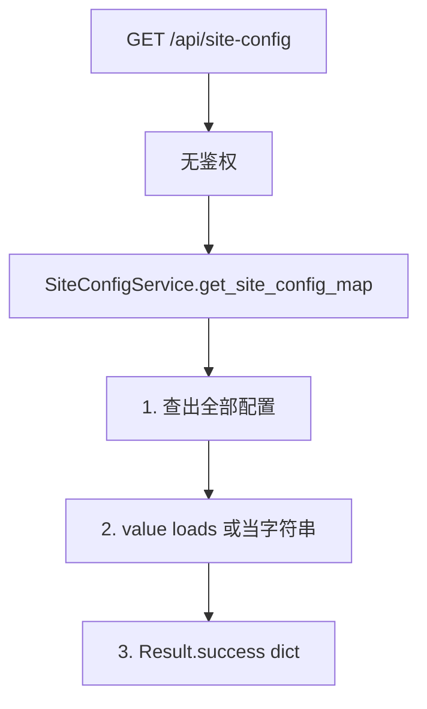
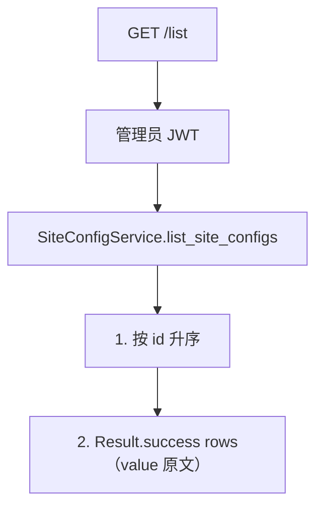
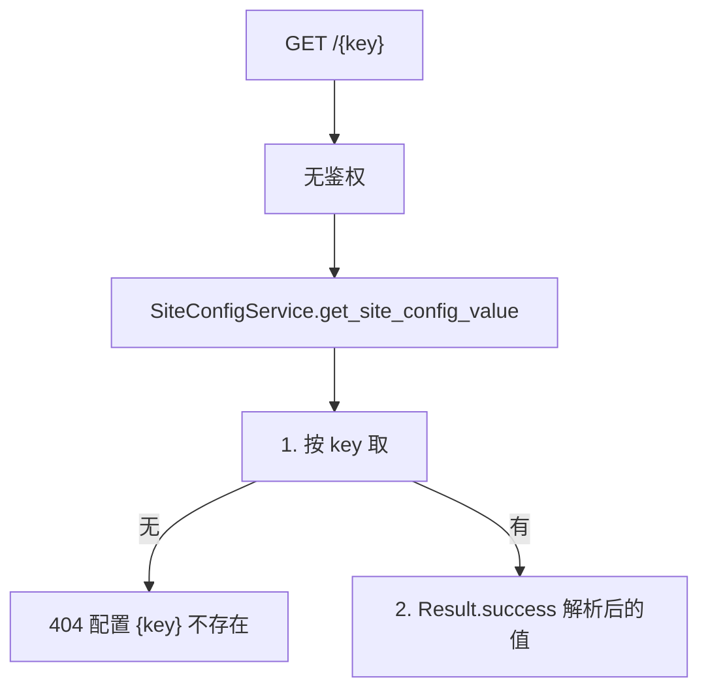
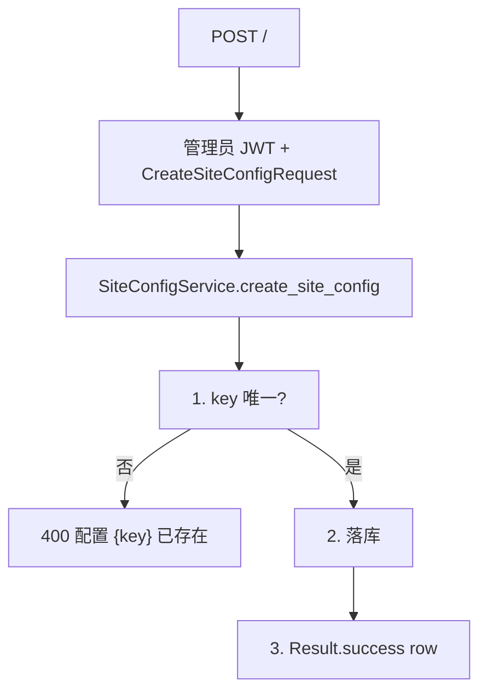
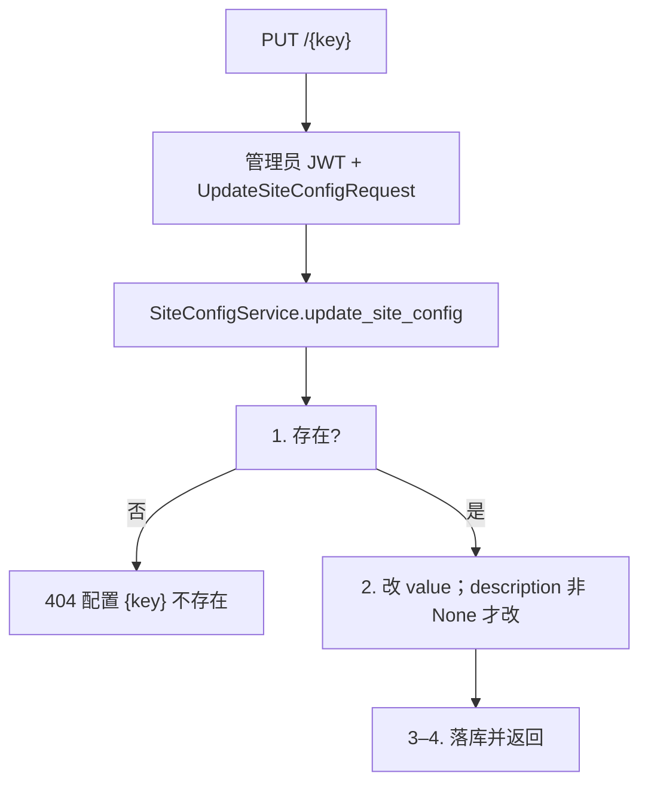
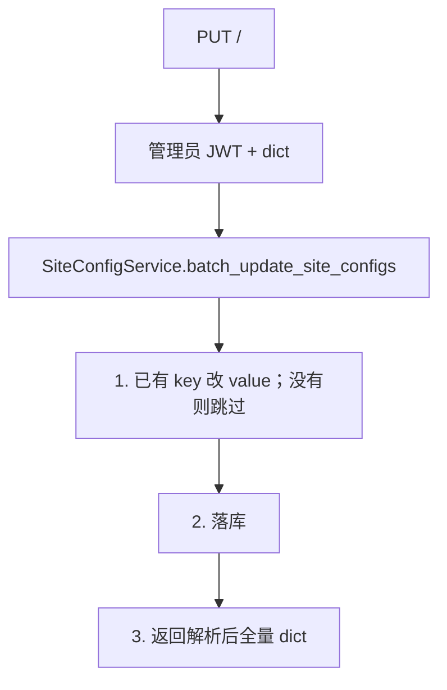
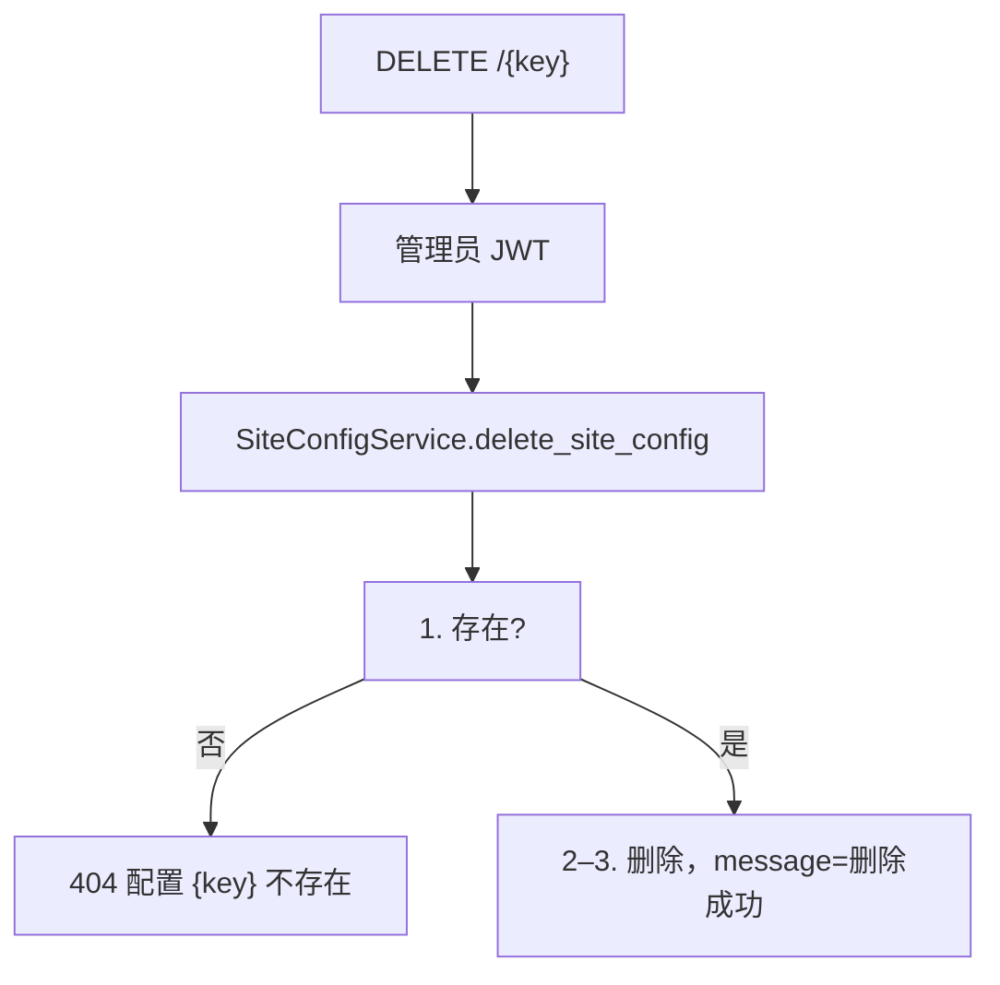
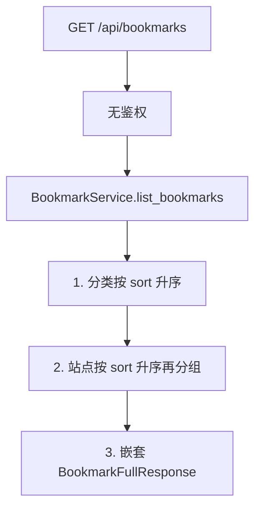
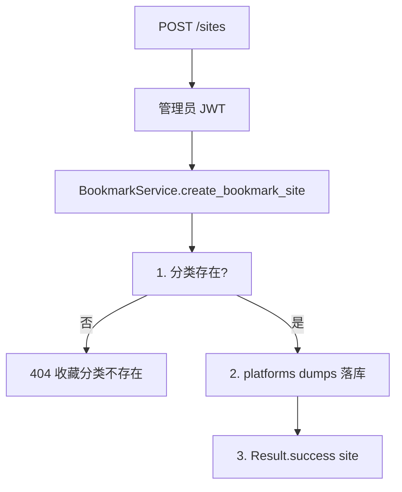

# 10 — 站点配置与收藏夹

> 对照源码：`app/api/SiteConfigRouter.py`、`app/api/BookmarkRouter.py`、`app/service/SiteConfigService.py`、`app/service/BookmarkService.py`、`app/schemas/SiteConfigSchemas.py`、`app/schemas/BookmarkSchemas.py`、`app/models/SiteConfig.py`、`app/models/BookmarkCategory.py`、`app/models/BookmarkSite.py`
>
> Swagger tag：`站点配置`、`收藏夹`　前缀：`/api/site-config`、`/api/bookmarks`

站点 KV 配置（前台 dict / 管理端完整行）与收藏夹「分类套站点」。路径是 **`site-config`**（连字符）。

## 1. 模块说明

| 项 | 站点配置 | 收藏夹 |
|----|----------|--------|
| 表 | `site_config` | `bookmark_category`、`bookmark_site` |
| 鉴权 | `GET /`、`GET /{key}` 公开；`/list` 与写须管理员 JWT | 读公开；写分类 / 站点须管理员 JWT |
| value | 库内永远是字符串；前台 `json.loads` 成功则解析，失败当普通字符串 | `platforms` 库内 TEXT JSON，请求/响应为 `string[]` |
| 种子 | 表为空时写入 `site_title` / `site_description` / `icp_number` / `icp_link` | 无 |
| 删除分类 | — | **级联删除**该分类下全部站点 |

**路由顺序（必须）**：

```
GET    /api/site-config
GET    /api/site-config/list      ← 必须在 /{key} 前
PUT    /api/site-config           ← 批量
POST   /api/site-config
GET    /api/site-config/{key}
PUT    /api/site-config/{key}
DELETE /api/site-config/{key}

GET    /api/bookmarks
GET/POST /api/bookmarks/categories
PUT/DELETE /api/bookmarks/categories/{cat_id}
GET/POST /api/bookmarks/sites
PUT/DELETE /api/bookmarks/sites/{site_id}
```

分类 `icon` 最长 50（短图标名）；站点 `icon` 最长 500（URL）。

相关文件：

| 角色 | 站点配置 | 收藏夹 |
|------|----------|--------|
| 路由 | `app/api/SiteConfigRouter.py` | `app/api/BookmarkRouter.py` |
| 业务 | `app/service/SiteConfigService.py` | `app/service/BookmarkService.py` |
| DTO | `app/schemas/SiteConfigSchemas.py` | `app/schemas/BookmarkSchemas.py` |
| 表 | `app/models/SiteConfig.py` | `BookmarkCategory.py`、`BookmarkSite.py` |

JSON 为 snake_case。成功信封 `{code: 200, message, data}`。

---

## 2. 前后端交接规范

### 2.1 接口一览

| 方法 | 路径 | 鉴权 | 说明 |
|------|------|------|------|
| GET | `/api/site-config` | 无 | 全部配置 → `{key: 解析后的值}` |
| GET | `/api/site-config/list` | 管理员 JWT | 完整行，value **未解析** |
| GET | `/api/site-config/{key}` | 无 | 单个解析后的 value |
| POST | `/api/site-config` | 管理员 JWT | 新建 key |
| PUT | `/api/site-config/{key}` | 管理员 JWT | 更新 value；description 不传不改 |
| PUT | `/api/site-config` | 管理员 JWT | Body 为 dict，只更新已有 key |
| DELETE | `/api/site-config/{key}` | 管理员 JWT | 删除 |
| GET | `/api/bookmarks` | 无 | 分类数组，每项带 `sites` |
| GET | `/api/bookmarks/categories` | 无 | 仅分类 |
| POST | `/api/bookmarks/categories` | 管理员 JWT | 创建分类 |
| PUT | `/api/bookmarks/categories/{cat_id}` | 管理员 JWT | 更新分类 |
| DELETE | `/api/bookmarks/categories/{cat_id}` | 管理员 JWT | 删分类及下属站点 |
| GET | `/api/bookmarks/sites` | 无 | Query `category_id?` |
| POST | `/api/bookmarks/sites` | 管理员 JWT | 创建站点 |
| PUT | `/api/bookmarks/sites/{site_id}` | 管理员 JWT | 更新站点 |
| DELETE | `/api/bookmarks/sites/{site_id}` | 管理员 JWT | 删除站点 |

未带 Token 调管理接口 → **403**；Token 无效 → **401** `无效的令牌`。

### 2.2 GET `/api/site-config`

公开。无 query。成功 `data` 为对象（不是数组）。种子解析后类似：

```json
{
  "code": 200,
  "message": "success",
  "data": {
    "site_title": "Kirameku",
    "site_description": "煌めく — 一个个人博客",
    "icp_number": "",
    "icp_link": ""
  }
}
```

种子入库是 `'"Kirameku"'` 这种 JSON 字符串，所以 loads 之后没有外层引号。

### 2.3 GET `/api/site-config/list`

需管理员 JWT。`value` 是库内原始字符串，**不** loads。

**data[]（SiteConfigResponse）**

| 字段 | 类型 | 说明 |
|------|------|------|
| id | int | 主键 |
| key | string | 配置键 |
| value | string | 未解析原文，如 `"\"Kirameku\""` |
| description | string | 说明，空则 `""` |
| updated_at | datetime | ISO 8601 |

无 Token → 403。不会把 `list` 当成 key。

### 2.4 GET `/api/site-config/{key}`

公开。成功 `data` 为解析后的值（可能是 string / number / object / array）。

**失败**

| HTTP / code | message | 何时 |
|-------------|---------|------|
| 404 | 配置 {key} 不存在 | key 对不上，`{key}` 为实际键名 |

### 2.5 POST `/api/site-config`

需管理员 JWT。

| 字段 | 类型 | 必填 | 默认 |
|------|------|------|------|
| key | string | 是 | |
| value | string | 否 | `""` |
| description | string | 否 | `""` |

成功 `data` 为 `SiteConfigResponse`。key 冲突 → 400 `配置 {key} 已存在`。

### 2.6 PUT `/api/site-config/{key}`

需管理员 JWT。`value` **必填**；`description` 不传则不改。

成功 `data` 为 `SiteConfigResponse`。不存在 → 404 `配置 {key} 不存在`。

### 2.7 PUT `/api/site-config`

需管理员 JWT。Body 例：`{"site_title": "新标题", "icp_number": ""}`。

已有 key 改 value；**不存在的 key 跳过，不创建**。成功 `data` 与前台 GET `/` 相同（解析后的全量 dict）。

### 2.8 DELETE `/api/site-config/{key}`

成功 `{ "code": 200, "message": "删除成功", "data": null }`。不存在 → 404 `配置 {key} 不存在`。

### 2.9 GET `/api/bookmarks`

公开。分类按 `sort` 升序；每个分类的 `sites` 也按 `sort` 升序。可空 `[]`。

**data[]（BookmarkFullResponse）**

| 字段 | 类型 | 说明 |
|------|------|------|
| id | int | 分类主键 |
| name | string | 分类名 |
| icon | string | 短图标名，空则 `""` |
| description | string | 描述 |
| sort | int | 越小越靠前 |
| created_at / updated_at | datetime | ISO 8601 |
| sites | BookmarkSiteResponse[] | 见下表 |

**sites[]**

| 字段 | 类型 | 说明 |
|------|------|------|
| id | int | |
| category_id | int | |
| name / url | string | |
| icon | string | favicon URL |
| description | string | |
| platforms | string[] | **始终是数组** |
| sort | int | |
| created_at / updated_at | datetime | |

```json
{
  "code": 200,
  "message": "success",
  "data": [
    {
      "id": 1,
      "name": "工具",
      "icon": "",
      "description": "",
      "sort": 0,
      "created_at": "2026-09-02T22:00:00",
      "updated_at": "2026-09-02T22:00:00",
      "sites": [
        {
          "id": 1,
          "category_id": 1,
          "name": "GitHub",
          "url": "https://github.com",
          "icon": "",
          "description": "",
          "platforms": ["web"],
          "sort": 0,
          "created_at": "2026-09-02T22:00:00",
          "updated_at": "2026-09-02T22:00:00"
        }
      ]
    }
  ]
}
```

### 2.10 GET `/api/bookmarks/categories`

公开。字段同 2.9 分类，**没有** `sites`。

### 2.11 POST / PUT / DELETE `/api/bookmarks/categories`

**创建请求**

| 字段 | 类型 | 必填 | 默认 |
|------|------|------|------|
| name | string | 是 | |
| icon | string | 否 | `""` |
| description | string | 否 | `""` |
| sort | int | 否 | `0` |

更新全部可选。删除会先删该分类下站点再删分类。

不存在 → 404 `收藏分类不存在`。删除成功 `message` 为「删除成功」，`data` 为 `null`。

### 2.12 GET `/api/bookmarks/sites`

公开。Query `category_id` 可选。按 `sort` 升序。`platforms` 为数组。

### 2.13 POST / PUT / DELETE `/api/bookmarks/sites`

**创建请求**

| 字段 | 类型 | 必填 | 默认 |
|------|------|------|------|
| category_id | int | 是 | |
| name | string | 是 | |
| url | string | 是 | |
| icon | string | 否 | `""` |
| description | string | 否 | `""` |
| platforms | string[] | 否 | `[]` |
| sort | int | 否 | `0` |

更新全部可选；`platforms` 传 `[]` 表示清空。分类不存在 → 404 `收藏分类不存在`；站点不存在 → 404 `收藏站点不存在`。

---

## 3. 后端接口执行流程

### 3.1 GET `/api/site-config`



### 3.2 GET `/api/site-config/list`



### 3.3 GET `/api/site-config/{key}`



### 3.4 POST `/api/site-config`



### 3.5 PUT `/api/site-config/{key}`



### 3.6 PUT `/api/site-config` 批量



### 3.7 DELETE `/api/site-config/{key}`



### 3.8 GET `/api/bookmarks`



### 3.9 收藏分类 CRUD

创建：落库后返回。更新 / 删除：不存在 → 404 `收藏分类不存在`。删除先删站点再删分类。

### 3.10 收藏站点 CRUD



更新 / 删除站点不存在 → 404 `收藏站点不存在`。
