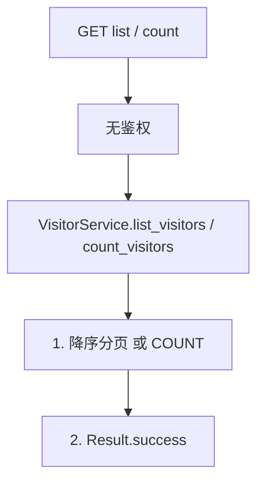
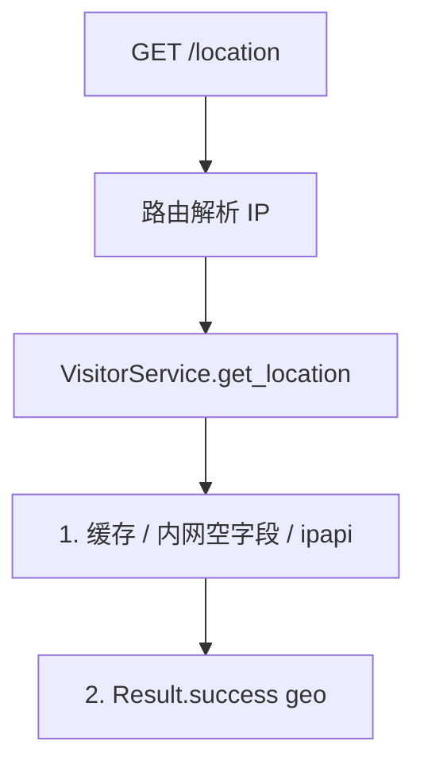
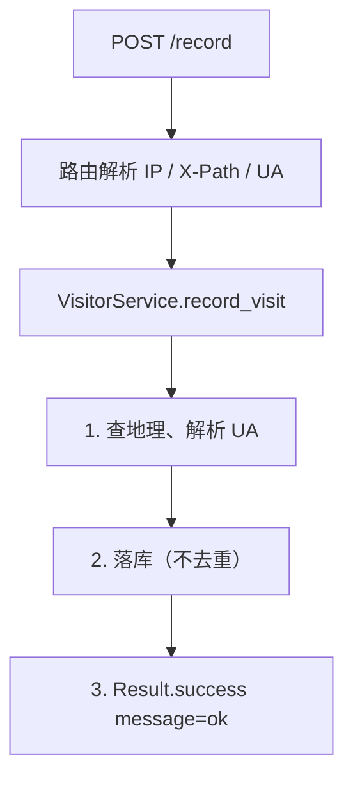
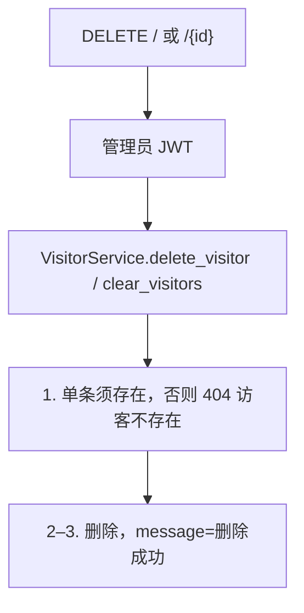
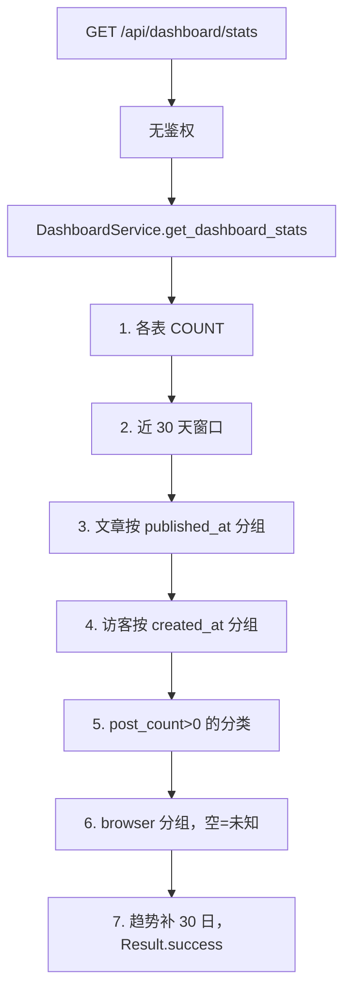

# 11 — 访客记录与仪表盘

> 对照源码：`app/api/VisitorRouter.py`、`app/api/DashboardRouter.py`、`app/service/VisitorService.py`、`app/service/DashboardService.py`、`app/schemas/VisitorSchemas.py`、`app/schemas/DashboardSchemas.py`、`app/models/Visitor.py`
>
> Swagger tag：`访客记录`、`仪表盘`　前缀：`/api/visitors`、`/api/dashboard`

只读统计 + 记录访问。地理走 ipapi.co，失败不阻断；删除/清空加了管理员 JWT（对照源码未加锁）。

## 1. 模块说明

| 项 | 内容 |
|----|------|
| 表 | `visitor` |
| 鉴权 | 列表 / count / location / record 公开；`DELETE` 须管理员 JWT；仪表盘公开 |
| 去重 | **不去重**；连续 POST `/record` 各记一条 |
| 地理 | `https://ipapi.co/{ip}/json`，按 IP **内存缓存**；内网 / 失败填空字段，不 500 |
| UA | 简单正则：browser / os / device_type |
| 趋势 | 近 30 天（含今天），缺日 `count=0`，长度恒为 30 |
| 日期 | PostgreSQL `func.date(col)` |

**路由顺序（必须）**：`GET /count`、`GET /location`、`POST /record`、`DELETE ""` 写在 `DELETE /{visitor_id}` 之前。

相关文件：

| 角色 | 访客 | 仪表盘 |
|------|------|--------|
| 路由 | `app/api/VisitorRouter.py` | `app/api/DashboardRouter.py` |
| 业务 | `app/service/VisitorService.py` | `app/service/DashboardService.py` |
| DTO | `app/schemas/VisitorSchemas.py` | `app/schemas/DashboardSchemas.py` |
| 表 | `app/models/Visitor.py` | 多表 COUNT |

IP：`X-Forwarded-For` → `X-Real-IP` → `request.client.host`。路径：Header **`X-Path`**，没有则为 `""`。

---

## 2. 前后端交接规范

### 2.1 接口一览

| 方法 | 路径 | 鉴权 | 说明 |
|------|------|------|------|
| GET | `/api/visitors` | 无 | 最近访客分页，新的在前 |
| GET | `/api/visitors/count` | 无 | 总条数 |
| GET | `/api/visitors/location` | 无 | 当前 IP 地理，不落库 |
| POST | `/api/visitors/record` | 无 | 进入页面时打一次 |
| DELETE | `/api/visitors/{visitor_id}` | 管理员 JWT | 删一条 |
| DELETE | `/api/visitors` | 管理员 JWT | 清空 |
| GET | `/api/dashboard/stats` | 无 | 聚合统计 |

无 Token 调 DELETE → **403**。

### 2.2 VisitorResponse

| 字段 | 类型 | 说明 |
|------|------|------|
| id | int | |
| ip | string | |
| path | string | `X-Path`，空则 `""` |
| user_agent | string | 原始 UA |
| city / region / country / district | string | 地理，失败为 `""` |
| org / asn | string | |
| is_mobile / is_proxy / is_hosting | bool | ipapi 无则 false |
| browser / os | string | 解析结果，空则 `""` |
| device_type | string | `mobile` / `tablet` / `desktop`，空则 `""` |
| created_at | datetime | ISO 8601 |

### 2.3 GET `/api/visitors`

**Query**：`page=1`（`ge=1`），`size=20`（`1..100`）。按 `created_at` 降序。成功 `data` 为数组。

### 2.4 GET `/api/visitors/count`

```json
{ "code": 200, "message": "success", "data": { "count": 2 } }
```

### 2.5 GET `/api/visitors/location`

不写库。本地 `127.0.0.1` 不 500，地理字段为空串 / false。

**data（VisitorLocationResponse）**：`ip, city, region, country, district, org, asn, is_mobile, is_proxy, is_hosting`。

### 2.6 POST `/api/visitors/record`

无 Body。Header：`X-Path`、`User-Agent`。成功：

```json
{ "code": 200, "message": "ok", "data": null }
```

地理失败仍 200，城市等为空。

### 2.7 DELETE `/api/visitors/{visitor_id}` · `DELETE /api/visitors`

需管理员 JWT。成功 `{ "code": 200, "message": "删除成功", "data": null }`。单条不存在 → 404 `访客不存在`。清空后 count 为 0。

### 2.8 GET `/api/dashboard/stats`

公开。成功 `data`：

| 字段 | 说明 |
|------|------|
| counts.posts | `status == published` |
| counts.drafts | `status == draft` |
| counts.categories / tags | 全表 |
| counts.comments / messages | 全表（含各审核状态） |
| counts.visitors | 访客全表，不去重 |
| post_trend | 近 30 天，按 `published_at` 日期，只计 published；长度 **恒为 30** |
| visitor_trend | 近 30 天按 `created_at`；长度恒为 30 |
| category_distribution | `post_count > 0` 的分类 `{name, value}` |
| browser_distribution | 按 `Visitor.browser` 分组，空为「未知」 |

```json
{
  "code": 200,
  "message": "success",
  "data": {
    "counts": {
      "posts": 1,
      "drafts": 0,
      "categories": 1,
      "tags": 0,
      "comments": 0,
      "messages": 0,
      "visitors": 2
    },
    "post_trend": [{ "date": "2026-08-04", "count": 0 }],
    "visitor_trend": [{ "date": "2026-08-04", "count": 0 }],
    "category_distribution": [{ "name": "随笔", "value": 3 }],
    "browser_distribution": [{ "name": "Chrome", "value": 10 }]
  }
}
```

`post_trend` / `visitor_trend` 实际为 30 项，上例只示意一项。无数据的日子 `count` 为 0。

---

## 3. 后端接口执行流程

### 3.1 GET `/api/visitors` · `/count`



### 3.2 GET `/api/visitors/location`



第三方失败走空字段，不抛错。

### 3.3 POST `/api/visitors/record`



### 3.4 DELETE 一条 / 清空



### 3.5 GET `/api/dashboard/stats`


